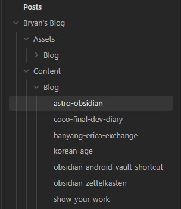

How to use Obsidian for your Astro website's content writing workflow.  
Integrating Astro posts to be edited in Obsidian is quite easy. For this to work we just need to link files with symbolic links(`mklink`). This post is focussed on Windows, but this is also possible on Mac by slightly adjusting the command.

## Integrating Obsidian Into Astro

I love writing in Obsidian. And just like Astro content collections, Obsidian is also based on .md files. So how can we utilise this to write markdown files in Obsidian that get added into our Astro project?

There are two different solutions:
1. Create an Obsidian vault within your Astro project. Then add the Obsidian project file to gitignore.
2. Create a folder in our Obsidian vault that has its content linked to the content in our Astro project.

Option 1 has a few problems. It is harder to include images within the Obsidian editor. We can't rename our vault, we would have to use the name of the file that contains our posts in Astro. And each project would use its own Vault.   
So we will go with solution 2.

Solution 2 also allows us to include the content of multiple Astro projects in one Vault.

(Mac uses a different command, check out [this video](https://youtu.be/dz3GOp4hN50) by Lazar Nikolov who explains how to do it on Mac.)

## Linking folders with symbolic links on Windows (10 / 11)
To start, open the cmd as an administrator. On the bottom left search on Windows, enter "cmd", right click and select "Run as administrator".

Here we will use `mklink /D LinkToNewFolder LinkToOriginalFolder` to create a symbolic link.

Symbolic links are advanced shortcuts in Windows 11 and Windows 10 that can point to a file or folder, redirecting applications to access them as if they were in a different location.

For my environment the command looked like this: `mklink /D "D:\Bryan\Documents\Vaults\Posts\Bryan's Blog\Content\Blog" D:\Bryan\Documents\Code\astrobryan\src\content\blog`

If you use paths that have empty spaces you need to put quotation marks around them.

The first path creates a new folder in my Obsidian project. The second path is the folder that contains all my .md posts in my Astro project.

Now you can already edit all of your posts using Obsidian. But the images are still missing.

## Including Images
I advise you to use a similar structure in your Obsidian vault as you have in your Astro project.

We use the same command this time, but instead we use the assets folder as the origin and point to the new assets folder of our Obsidian Vault: `mklink /D "D:\Bryan\Documents\Vaults\Posts\Bryan's Blog\Assets\Blog" D:\Bryan\Documents\Code\astrobryan\src\assets\blog`.

Now we can see all our images and edit our Astro posts, all within Obsidian. We can define templates to pre-define content we would use on every new post, such as the frontmatter, content structure, image links, html snippets, or anything really.

I also changed how the frontmatter is displayed. You can do this under `Settings -> Editor -> Properties in document -> Source`, this way the frontmatter looks more clear.

That's it! 🎉 Enjoy writing your posts in Obsidian now.

  
References

  
- https://www.howtogeek.com/16226/complete-guide-to-symbolic-links-symlinks-on-windows-or-linux/
- https://www.reddit.com/r/ObsidianMD/comments/1943yza/a_lazy_mans_obsidian_astro_workflow_integration/
  

