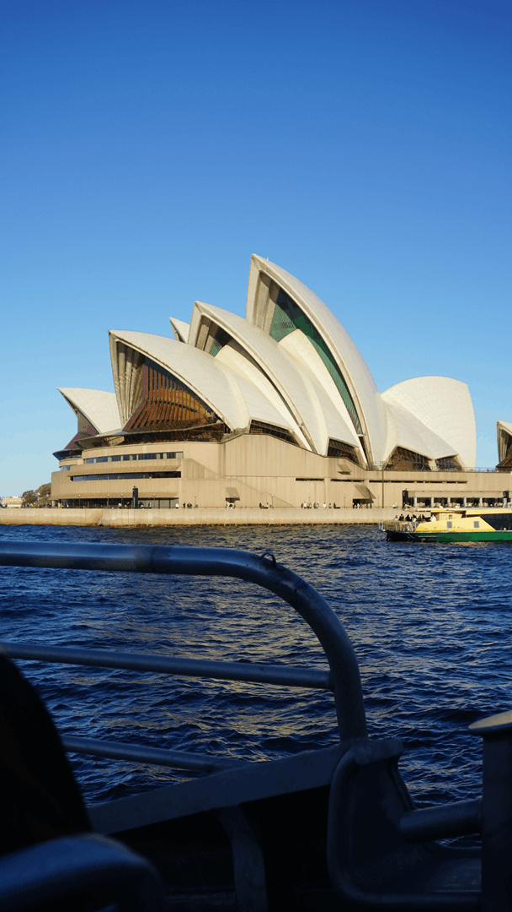
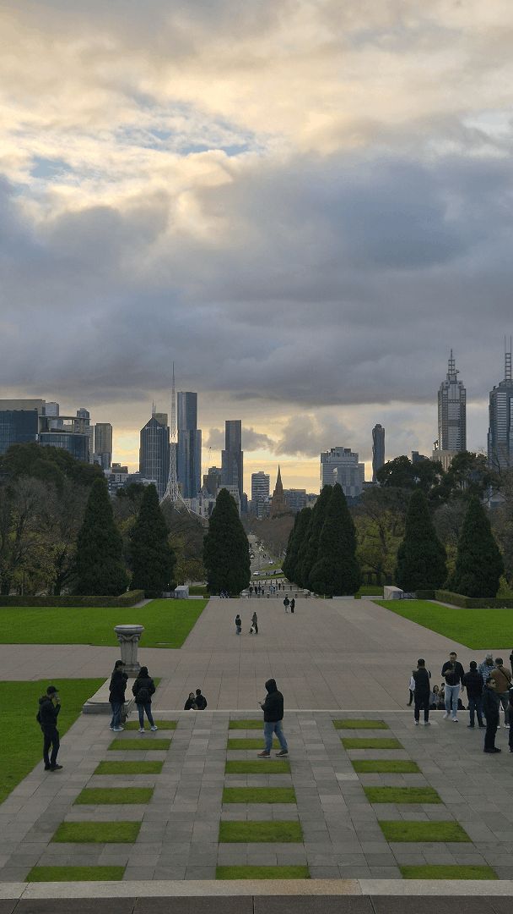
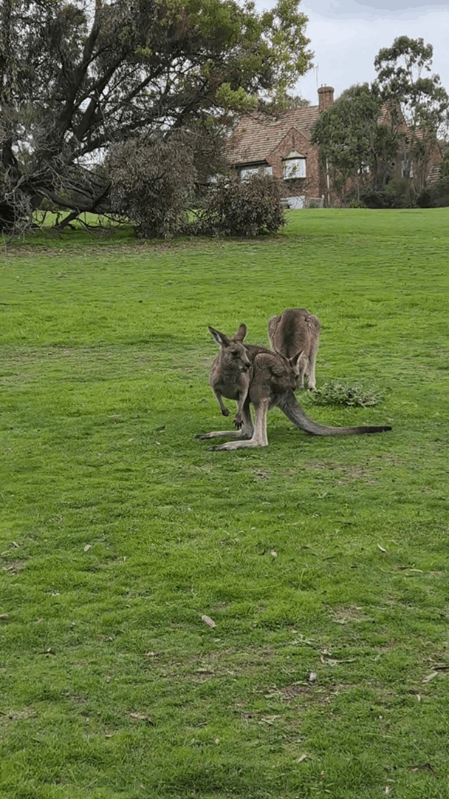
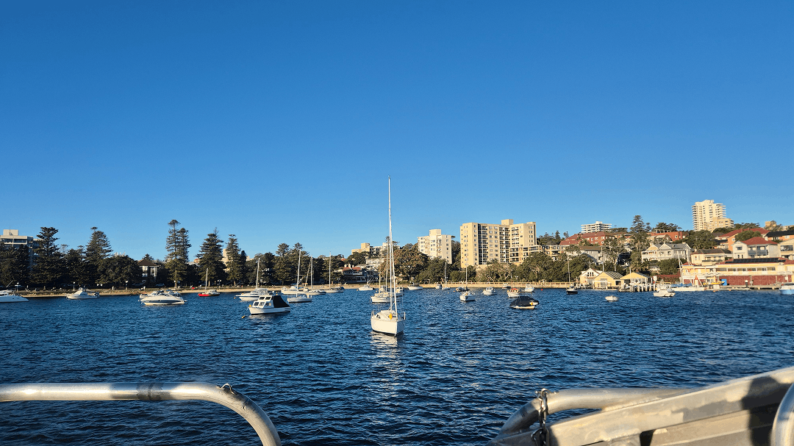
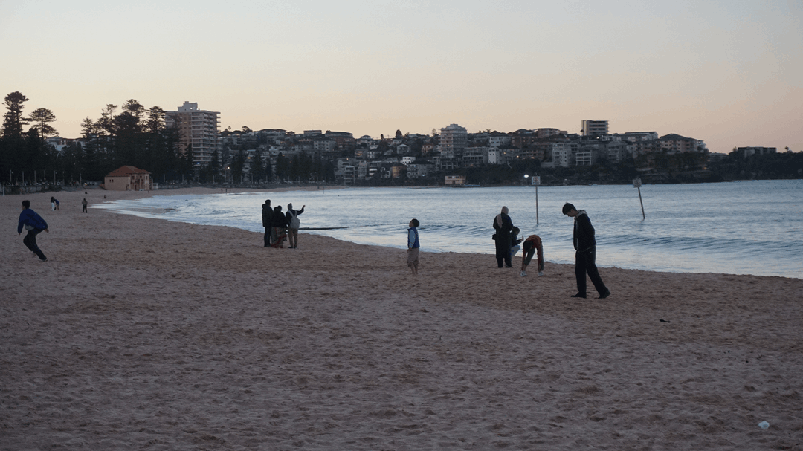
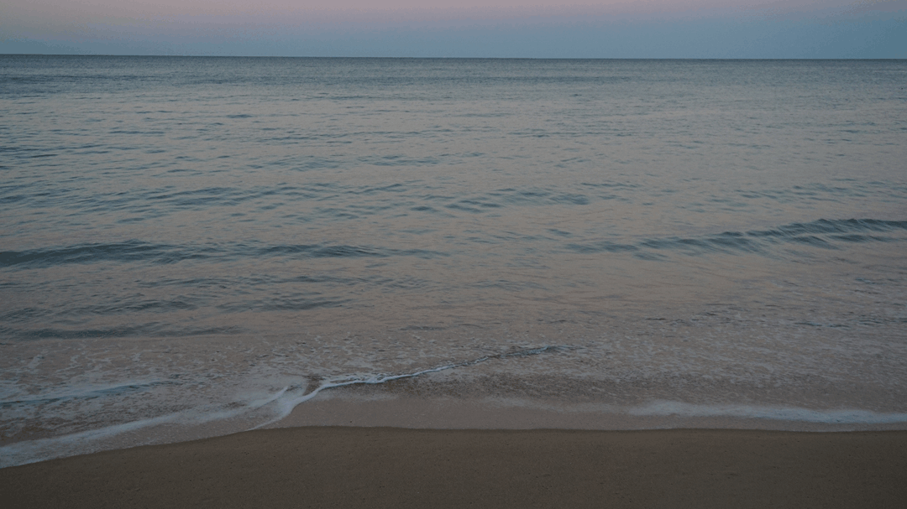
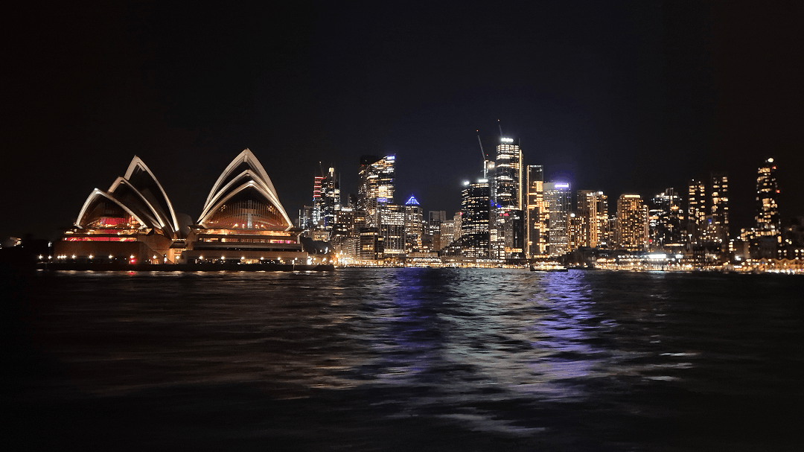

After [Macau](/blog/living-in-macau), China, [Korea](/blog/south-korea-travel-guide) and [Japan](/blog/working-holiday-japan), my journey continued to Australia.

I did a Working Holiday in Australia, so here I will cover practical tips for doing one yourself and my experience.

## What to prepare for a Working Holiday in Australia

Obviously, for a Working Holiday you will have to apply for the [Working Holiday visa 417](https://immi.homeaffairs.gov.au/visas/getting-a-visa/visa-listing/work-holiday-417) / [Working Holiday visa 462](https://immi.homeaffairs.gov.au/visas/getting-a-visa/visa-listing/work-holiday-462). Depending on which passport you have, this process might vary a bit, but overall I found the process to be quite easy and fast. It was expensive though, as I had to pay for the visa and a medical assessment at one of just two doctors' offices in Germany.

To get the visa, you'll probably have to be between 18 and 30 or 35 years old and have at least 5000 AUD in your bank account at the time of applying. These criteria might change in the future and might differ between countries, so check the official website.

### What else to prepare before going to Australia?

What else to prepare?

- **Vaccines**: Ask your doctor which vaccines to get
- **Money**: Housing in Australia is expensive. Food is not cheap. If you want to go outside the main cities get a car, which will also cost you a good amount. Don't expect to instantly get a job.
- **International driver's license**: To drive a car you will need an international driver's license.
- **Health insurance**: Make sure to get health insurance that covers your full stay. The most common health insurance policies that run for one year will only cover your first two months abroad.

Otherwise, I found things to be quite relaxed, you'll just have to do most things once you get there.

The process of entering with the Working Holiday visa was very simple, there was no need to register anywhere. I was surprised that I didn't even have to show my visa at immigration after landing.

### What to get once in Australia

Things to do once you are in Australia:

- **Get an Australian phone number** (SIM / eSIM): You will need a phone number, e.g. for creating a bank account or when job hunting. I used an eSIM from Amaysim, as the prices were low compared to others, it was easy to set up and cancel, and it still used the Optus network, which had good enough coverage for me.
- **Get a TFN** (Tax File Number): You will want to give this number to your employer so you will pay less taxes on your salary.
- **Transit card?**: To take public transport you might need a transit card, but that depends on your region. In Melbourne, you will have to get a myki card, whereas in Sydney you can just use your regular Visa or credit card.
- **Open a bank account**: You will need an Australian bank account to receive a salary. It also makes sending money much easier.
- **Superannuation**: While working on a Working Holiday visa, a certain amount of your pay goes into superannuation, which is kinda like your pension / retirement money. As you probably will not stay in Australia for that long, you can get that money at the end of your Working Holiday, although you will pay a high tax on it (currently around 65%). There are different providers with which you can create your superannuation account, e.g. Hostplus or AustralianSuper.
- **Create a myGov account**: This is not too important, but useful for handling taxes later on.
- **Certificates**: Depending on what kind of work you want to do, you will need some certificates. For example, the RSA (Responsible Service of Alcohol) or the White Card (general construction induction card) are useful. I go into more detail further below.
- **Housing**: Book a hostel in the beginning. Use that address for some documents such as the TFN and bank account (If they can receive documents for you, usually they do). I go into more detail on housing further below.

## How to find work in Australia

Before you can get a job, there are four things you'll need:
1. Australian Bank Account
2. Tax File Number (TFN)
3. Australian Phone Number
4. Trade Certificates

### Certificates

I already talked about the first three, but what about the **trade certificates**? Depending on your type of work, you'll need certain types of certificates.

To find work at a place that serves alcohol, you will need an RSA (Responsible Service of Alcohol) certificate. The RSA varies from state to state, so e.g. in Melbourne, you will need a Victorian RSA (as it's in the state of Victoria).

If you want to work in construction you will need a White Card.

### What does an Australian CV look like?

To actually get a job you'll want a resume that is tailored to the Australian job market.

- You should definitely include an Australian phone number and address. It's very common for employers to call you to have a first conversation. They also want to be sure that you are nearby.
- Keep it short; a single page is preferred. Especially for service and retail jobs where you might physically hand out your resume, I recommend sticking to a single page.
- Be clear about when and how long you can work.
- Consider using Australian vocabulary when relevant.
- Writing "references available on request" is okay.
- Do **not** include a photograph of yourself.

Of course, do the usual: keep it simple and clean, emphasise your experience and skills relevant to the role, create a different version for each job, avoid spelling mistakes, and avoid AI slop (after seeing hundreds of resumes, it becomes obvious what was written by AI). The people I met at hostels often greatly exaggerated their experience and background for service jobs.

### Finding work in labouring, hospitality or admin?

Most backpackers / people on a Working Holiday visa work in one of these three fields:
1. Labouring / construction
2. Hospitality / service
3. Admin / office work.

While work for people on Working Holiday visas isn't limited to these three fields, they tend to be the most accessible.

The common job platforms such as [Seek](https://au.seek.com) or [Indeed](https://au.indeed.com/) get a lot of applicants, so what can you do to increase your chances?

**Hospitality:**

The turnover rate is quite high and you will often find restaurants or cafes hiring, but positions can be quite competitive.

Although tipping is not really a thing in Australia, hospitality work is still quite sought after as the minimum wage is decent, especially on weekends when pay rates are higher.

The most common way to gain employment in the hospitality sector is by printing your resume and handing it out yourself at restaurants, bars or cafes. Introduce yourself, have a good conversation, hand them your resume if they are hiring for what you are looking for, and maybe they will call you later. Try to speak to the manager / the person who can actually hire you. Jobs in this sector can be quite competitive, so make sure you visit a lot of places, especially in larger cities. Go while they are not busy.

Barista jobs are incredibly competitive in cities such as Melbourne. *You will not find work as a barista if you don't have at least 2 years of experience and a great CV / portfolio of your work*. You have a better chance of finding work as a waiter, in a front-of-house role or in a similar position.

Facebook groups are also very popular, yes, **really**. But be aware that scammers may contact you after you post in these groups. Look for "Working Holiday", "Backpacker" and similar groups. Groups which are focused on the city you are in could be especially helpful, e.g. for Melbourne, "Melbourne Bartender Exchange" or "Melbourne Waiter Exchange".

Make sure to also speak to your new friends and fellow travellers.

Also consider using:
- [Pinnacle People](https://www.pinnaclepeople.com.au/)
- [Barcats](https://www.barcats.com.au/)
- For one-off shifts: [Airtasker](https://www.airtasker.com/au/) or [Supp](https://suppapp.com/)

Many hostels also have a blackboard where you can find work.

**Labouring:**

For labouring work, I found these agencies recommended in the Melbourne area:
- [JV Recruitment](https://www.jvrecruitment.com.au/)
- [Hays](https://www.hays.com.au/)
- [Labour Solutions Group Australia](https://www.laboursolutionsgroup.com.au/)

Make sure you have the White Card before applying for any jobs / agencies. Make sure you already have the relevant work gear or are able to borrow it.

**Admin / Office work:**

Finding office work on a Working Holiday visa is very difficult. But you might be able to find a sales position. Try contacting relevant agencies, although consider looking for hospitality or labour work instead if you don't get responses.

Companies would prefer not to hire people on a Working Holiday visa. One reason for this is that you can only work up to 6 months at the same company (only specific exceptions apply).

---

Depending on your background, there might also be sites for your specific language, e.g. [Melbourne Sky / 멜번스카이](https://melbsky.com/) for Koreans.

### Be aware of scams and unfair work

Make sure you get paid [at least the minimum wage](https://www.fairwork.gov.au/pay-and-wages/minimum-wages). [Sundays have particularly high pay rates for some jobs](https://www.fairwork.gov.au/pay-and-wages/allowances-penalty-rates-and-other-penalties).

## How to find housing in Australia

When you first get to Australia I recommend staying at a hostel. Generally housing, especially in the large cities, is quite expensive. There are many cool hostels. The first hostel I stayed at felt like a community and I enjoyed making new friends there.

So I can highly recommend trying a few hostels when you first arrive, as it allows you to make meaningful connections that can make your journey much better. At hostels you can often pay in person for a week and get a discount.

But you might not want to stay at a hostel for too long, understandably so. So how to find an apartment to live in?

- Facebook groups
- [Flatmates](https://flatmates.com.au/): For rooms and share houses. Create your own profile here and let people contact you and also view listings.
- [Realestate.com.au](https://www.realestate.com.au/) and [Domain](https://www.domain.com.au/): If you want your own apartment / proper lease.

Always inspect the place yourself before paying. In Australia, rent is commonly quoted as a weekly amount.

## Further notes on daily life

It's very common to cook at home, as restaurants in Australia are quite expensive. The common supermarkets are Coles, Woolworths and Aldi. Check local markets as well for some better prices on fruits and vegetables. The convenience stores are very overpriced.

You can find household items at Kmart, Big W, Target or Daiso. Chemist Warehouse is a pharmacy chain with decent prices.

## Extending your visa

It is also possible to extend your Working Holiday by applying for up to two additional visas, allowing you to stay for a total of 3 years. However, this has recently been made more difficult.

Visa prices have also recently increased. As of September 2026, getting a second- or third-year Working Holiday visa is becoming more difficult, as applicants will have to enter a random ballot and there will be a strict cap on how many can receive another visa. The previous requirement of completing 88 days of specified work for the second-year visa, or six months for the third-year visa, will also remain in place. (*UK passport holders are exempt from the specified-work requirement.*)

## Do I recommend a Working Holiday in Australia?

I came to Australia after already travelling quite a bit. I was exhausted from constantly changing where I lived, getting used to a new place and culture every time, making new friends, learning how to live in a new place, and finding new housing. What made things stressful for me was that I had to keep worrying about money, which is not fun when staying in a place as expensive as Australia.

So I came to Australia hoping to stay in one place for a while and get work there. But I couldn't find any good work. So, after having enough of the constant stress and eating porridge every day, I decided to go back to somewhere where I'm not heavily limited by the visa I have. In Europe, I could find better-paid work, have more opportunities, also due to my better network, do something that is more relevant for my career growth, do something that aligns more with my interests and skills, and stay longer. Big cities such as Melbourne and Sydney felt quite similar to cities in Germany and England.

If you are burned out from your job, want to try something new and enjoy your life after doing the same thing every single day while still being in a culture that is not too foreign, then I can recommend doing a Working Holiday in Australia.

I posted more impressions of my [time abroad in Australia on Instagram as a Story Highlight](https://www.instagram.com/stories/highlights/18591269974036494/).