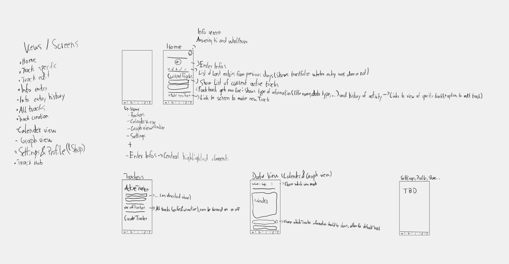
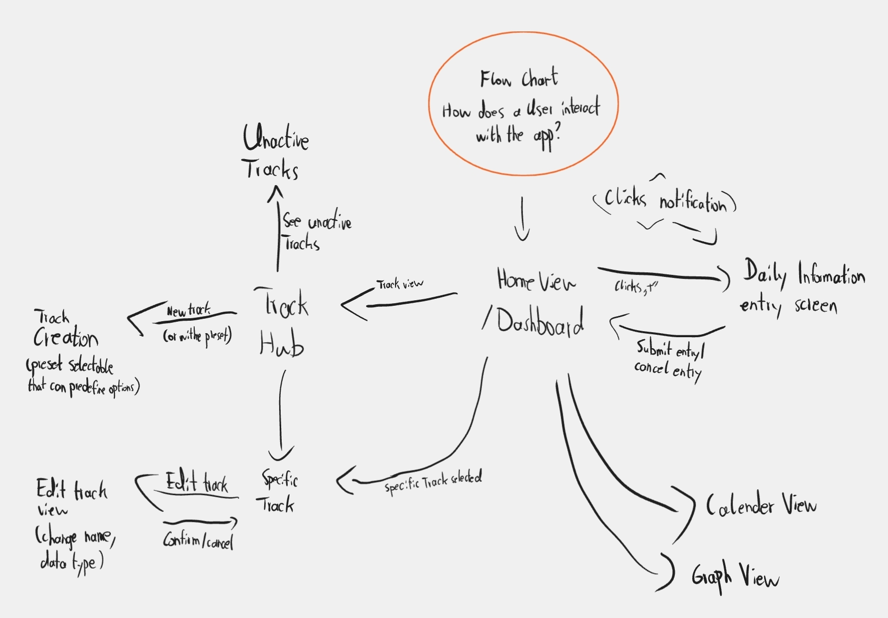
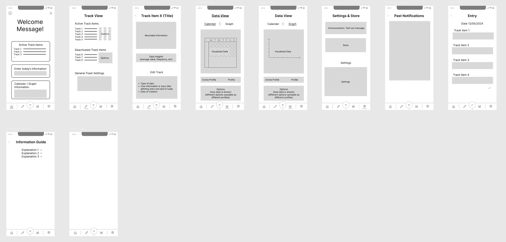
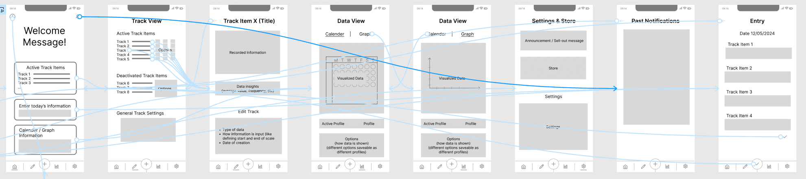

For my last semester at Code & Context I am creating an app to help you keep track of what matters to you.

*This is an ongoing post, I will be adding updates as I am working on the project.*

## Week 0 - Getting Started

After collecting and refining many ideas throughout the past months I've decided on what to write my proposal on. The proposal is a short document needed for me to start into my final project and then the bachelor thesis. After working 8-10 weeks on this final project I can start on my thesis.  
Next up was finding a professor willing to be my supervisor and completing the short proposal.

I was able to find a supervisor and completed my proposal, now it was time for me to go back to university for the first time after my year [abroad in South Korea](/blog/hanyang-erica-exchange). I had a meeting with my supervisor, got feedback on my proposal and then knew in which direction to go into and how to approach my project.

My idea is to build an app which works as a tool for effective journaling, habit building and keeping track of information for self-reflection, achieving goals and improving personal health. One of the first impressions I heard was that it sounds like a "Eierlegende Wollmilchsau", a egg-laying, milk-bearing woolly sow. A German phrase used for something that only has benefits, meets all requirements and is useful for every purpose always, thus it is impossible to create since its requirements are not feasible for reality.

The actual idea of the app is not that complex. Once per day the user should be prompted to enter information into the app. What information is up to the user. This way the user can choose what they want to keep track of, like how many minutes they read today, state of a health condition or whether they did sports that day or not.  
The user can decide what to keep track of and in what way. So also which type of data it should be, like a text field, single word, number, unit, number on a scale or true or false statement.

The user should then be able to view this tracked data in a way that allows them to analyse it, such as a graph or calender view.

What can this be useful for?  

- **New healthy habits**. Do more sports or read more books. Gamify a habit by keeping a daily streak. Or note down how many minutes the activity has been done each day. Optionally set a minimum amount of minutes you want to read each day. Visualise the tracked data to see if you are going into the direction you want to go into. 
- **Break old habits**. Just how the app can be used to acquire a new habit, it can also be used to help to quit old ones, like smoking or other toxic instant gratifications.
- **Mood tracking journal**. Track your mood and write a quick journal each day. Get an overview of your mood each day. Understand the relation between your mood and the activities of each day.
- **Understanding Food Allergies & Intolerances**. Get a better understanding of what food you can and can't eat. Track each day how well your stomach feels or how well you can digest the food and also what food you ate that day. Have an overview of days where you feel well and what you ate then but also the days where you felt unwell.
- **Understanding Health Conditions**. Get a better understanding of one of your personal health problems. For example, keep track of how bad your chronic migraines are each day and note down what you did that day. Get an overview of days where you feel well and see what you did then but also what you did on days where it feels worse.

One of the greater challenges of this project will be building a suitable and easy to understand interface while still allowing for high customizability and quick ways to enter information.  
Also need to think about how to improve the pitch of this app. How can I better explain in just a few words what the app is about?

## Week 1

### Market & Competing Products Analysis

As part of the process of defining what the app should be I also had to look for already existing tools. What do they do? How do they look? What do they do well? What can be improved? 

With this understanding of what's already out there I can adjust my app. I can see what's already working but also how to differentiate myself in a way that brings additional value. No idea is born in isolation, each idea is born out of past experiences and already existing solutions.  
This is also a fundamental step to decide whether my idea is even worth to pursue or not.
The insight gained from this step had also major influence on the idea already described above.

This was an ongoing process, from time to time I would hear of new ways people use journaling and self-tracking. As of now I took a look at the following apps: Health Tracker, Google Fit, Bearable, HabitNow, RoutineFlow, Daylio, Moodpress, Habitica, DailyBean, Wysa, Fabulous, WellLog, MyRoutine, Chrono.me, Tally Tracker: Count Anything and Metriport.

There are some worth highlighting:
- **Chrono.me** - Very close to the idea I want to create. For me it fails in how the UI and UX is designed. I think there is a lot of potential to improve the UI and make it faster for the user and easier to understand. Also many basic functions seem to be gated behind a pay-wall.
- **WellLog** - Very close to my idea as well. The app is focussed on habit tracking only though.
- **DailyBean** - Although it's use case differs quite a bit from my app, I really liked the UI and part of the monetization here. It has it's own custom currency which can be spent to buy different visual themes, all of which look beautiful (and cute).

### User Survey
With the survey I want to find out more about the people who use such tools, how do they think, what's important to them?

Getting a general understanding of how people think and how they use such tools is important. Also collected the information of people who'd be interested in trying out a first MVP for testing.

With the knowledge from the survey I can refine my idea, improve the overall design and better evaluate how important certain features are.

After a few iterations of thinking of what do I really want to ask, testing with some people and then adapting changes I had a survey which will help me find some answers and give me some confirmation for the hypothesis I put up.

### How To Make An App
Relevant for making an app are also the tools to make an app 🤯. Since I already felt comfortable with web-development I was mostly choosing between React Native with Expo or Capacitor with Ionic. After some back and forth I decided to stick with React Native. Other than reading [posts](https://capgo.app/blog/comparing-react-native-vs-capacitor/) and watching [videos](https://youtu.be/-tTVYqyNZas) on the two frameworks I found this [HackerNews discussion](https://news.ycombinator.com/item?id=38500146) useful to aid my decision.

For React Native there are more resources, the community is stronger and it also just feels like the more stable and safe option.

| Name | Usage | Programming Language | Popularity |
| --- | --- | --- | --- |
| Flutter | Native Apps | Dart | Very high |
| React Native | Native Apps | Javascript, React | Very high |
| Capacitor (w/ Ionic) | Hybrid Apps | HTML, CSS, JS | Low |

There were some other options I also stumbled upon, like NativeScript or Xamarin, but they either seemed long forgotten and abandoned with no community support behind them or not reasonable viable to make an Android and IOS app from a single code base efficiently.

## Week 2
This week was focussed on:
- Learning React Native
- Getting started on developing the app

### Development
This was my first time using React Native, it's harder then expected. I hoped for more of my web development knowledge to carry over. It's a bit frustrating to only be able to create interfaces at 1% of the speed to what I'm usually used to. But I expect to get quicker once I get familiar with React Native. This is reminding me of how much I struggled when I first started coding my first webpage.

Also spent a nice amount of time figuring out that it was the default emulator that Android Studio installs that kept crashing my pc. And a bit disappointed in the Apple ecosystem regarding how closed of it is, it's not even possible to emulate an iOS system on a windows or linux machine.

Once I have a better understanding of how React Native works I will create a plan of how I want to structure my app, create a plan of what elements belong where and how I want to structure it. This should also be the time when I create a basic wireframe or example image of how the app could look like.

## Week 3
Focus of this week:
- Learn React Native
- Design the app
- Evaluating the survey

With a basic understanding of how React Native works I felt ready to get started on designing the app.

### Sketch

I began by creating a rough sketch of the different views / pages the app will have. My only goal here is to understand which views, components and data I will be interacting with.

### Flowchart

In addition to the sketch I created a rough flowchart on how the user can interact with the app. This will help me design the overall layout. Elements and pages that are navigated to often should be placed somewhere where they are easily accessible.

Both are very far away from how the app will ultimately end up looking, but that is also not their function. They are only there to help me understand how the different elements will be interacting with each other and how I can design a smooth navigation throughout the app.  
With the insights from both the sketch and rough flowchart I can get started on a wireframe.

## Week 4 - 7

### Wireframe

With the sketch and flowchart at a state where I am happy with them I made a first version of the wireframe.

A wireframe should be more detailed than a sketch and flowchart.

In a wireframe I go into more details of the layout, like what elements are on the home page, which navigation elements lead to where, what are the rough sizes of elements. At this step I still do not care at all about the design details. I don't waste any time on thinking of the name for the app, colors, animations, typography, domain name, you get it, all of this does not matter for now.

In a wireframe the size of elements matters. Important elements should be large, less important elements should be smaller.  
I add names where they are relevant, such a titling the different views and what element represents what. Details are abstracted away.

I used Figma to create this wireframe. I already had experience using Figma for creating various graphics, it also offers all the tooling needed to create wireframe. Figma was the perfect tool for this. In Figma it is possible to create such wireframes or mockups by dragging links from elements to other frames. 
With the Figma app downloaded on my phone I could open the home page image on my phone and let others experience what navigating through the app really feels like.

With a presentable wireframe I got started on testing. I give the wireframe to people and see how they interact with it. What works well, what do they struggle with?

I found it more useful to test with people that understand what I wireframe is and what use-case it has.  
With this I got a lot of insight on how people feel about the overall navigation and what they think of the name and icons representing the different parts of the navigation.

<video width="100%" height="400" controls muted>
  <source src="/videos/Bryan-Hogan-CoCo-Final-Dev-Diary-Wireframe.mp4" type="video/mp4">
  Your browser does not support the video tag.
</video>

There were a lot of discussion about the navigation bar at the bottom. In the end I decided to keep it but also include the icons in all other elements that link to the same pages, this makes it more clear that clicking there leads to the same destination.

Really valuable was also getting feedback on how it feels to enter information. For successfully entering a days information the app did nothing, there was no indication that information was added successfully nor some sort of other positive reaffirmation for the users, like a celebratory animation. This is important, successfully entering information will have to feel rewarding.

In my first version I added a large title greeting the user. In the moment it felt natural to add a large text greeting on the first page of the app, but this would be a great waste of space and make the overall UX worse. But with some creative ideas by my test participants I now got ideas on what to use this space for.  
My current idea is to add a image / vector graphic of a plant, the state of the plants improves when the app is used more, such as overall usage or daily streaks. But I will have to keep in mind that users should have the option to disable rewarding streaks of daily usage, in case they feel forced or stressed to use the app daily, which could negatively impact their experience.

### Dropping React Native
During these weeks I have decided to stop using React Native to build my app. React Native is a capable tool, but not the right one for me. I kept running into problems, styling was much harder than it should be, the development process felt far too slow. And for me it also didn't feel that enjoyable to use.  
Getting an app from this which can be used on a desktop pc, such as a web view or windows/linux/mac version, also seemed much harder to do. According to my survey a desktop version didn't seem highly important, but relevant enough that it should be there.

React Native does not feel intuitive for someone who already knows React or web technologies such as HTML, CSS and JavaScript/TypeScript. The slight advantages it can give in performance or native functionality also did not seem to matter yet in my project.

### The New Tech-Stack
With my new tech-stack I can instead build a website and then build this into a native feeling app that can be added to the Play or App Store. So what did I use?

#### CapacitorJS

Instead of continuing with React Native I decided to go with CapacitorJS. Of course abandoning code did not feel good, but this seemed to be the better long-term decision for me now.

CapacitorJS allows you to make any web project into a native feeling app, a web native app. By using this any project consisting of HTML, CSS and JavaScript/TypeScript can be brought into the Google Play Store and Apple's App Store.  
So now I am creating a website which is made into an app, something I feel much more comfortable and faster with while also supporting more platforms.

Capacitor also allows the use a many native features.

#### Ionic React

For creating a website it is common to use a framework. I decided to go with React, since that also seems to work well with Capacitor. But instead of using React standalone I also added Ionic.

Ionic and Capacitor are often used together. Ionic is mostly a styling library which makes your app feel more native and seem less like a website. It offers various components that can change their styling depending on which platform they are used, iOS or Android.  
I was unsure whether I should use Ionic or not, since I also like writing my own styles without being limited to pre-defined styles. I decided to go with Ionic to see how well it works, it also includes help with routing which might be harder to get right by myself. By using this styling library I can also get faster to building the logic, at least once I understand how to use it. Ionic does change a lot on how my code looks since I now always use various Ionic components instead the common HTML elements.

[Ionic React](https://ionicframework.com/docs/react) is its own framework that combines Ionic with React.

#### Electron

As I am now building "just a website" I can throw in Electron into the tech-stack and get builds for Windows, Mac and Linux done in minutes. There is a [custom Electron integration](https://capacitor-community.github.io/electron/) for Capacitor projects made by the community which made this add-on very easy to include.

#### PostCSS Preset Env

As I am now writing normal CSS again I can also use useful CSS enhancements such as PostCSS. Similar to SASS or SCSS it can improve how you write CSS. I like PostCSS since it is the most customizable out of these three. By itself it actually does nothing as it is fully dependent on which PostCSS plugins you use.

One of the best PostCSS plugins out there is [postcss-preset-env](https://www.npmjs.com/package/postcss-preset-env) which makes writing CSS much nicer. It converts modern CSS into something older browsers can understand. With this there is no need to include multiple lines of annoying vendor prefixes such as `-ms--transition` or `-webkit-transition` as the one `transition` line gets converted automatically for all browsers to understand on build.

### Survey Results

Prior to finalizing my decision to change my tech-stack I also went through the survey results.

Got information on how and why people use self-tracking. And the answers were various, from answers on goals for studying more to period tracking and psychological help.

## Week 8 - 12

My final weeks have been spent on writing text instead of developing the project further. Need to write a report about what I did and what I will be doing for my thesis.
