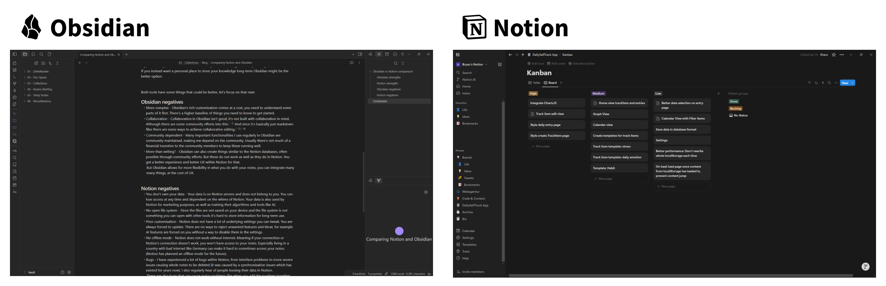

Both Notion and Obsidian are great tools, highly used and very flexible writing apps. But Obsidian and Notion are good at different things, so which tools fits best for your use case?

## Overview
Let's compare the strengths of each tool with a focus on what makes it great compared to the other.

### Obsidian strengths

- **Markdown files** - Markdown is great, you can use these files in many other programs and they stay accessible to you even if Obsidian stops existing. Creating links to other notes is very quick.
- **Offline** - Everything is offline by default.
- **Own your data** - You own all of your data, since Obsidian is just a layer on markdown files.
- **Deep customisation** - Obsidian not only has many settings that allow you to only activate things you really need, it also has many visual themes and thousands of plugins. It also has a Canvas and the Web Clipper plugin.
- **Build your own adjustments** - Obsidian allows you to customise it how you want, you can always write a plugin for your specific needs. It uses widely used and basic technologies like CSS and TypeScript which makes development simple and efficient.
- **Desktop and mobile versions** - Both the desktop and mobile version work great and give you full functionality.[^3]

### Notion strengths
- **Easy to use** - Notion is especially easy to just pick up and start using. No need to first understand something like markdown syntax.
- **Collaboration** - Collaborating on the same documents is simple in Notion and works well, everything is updated in real-time and you can see what others are doing.
- **Tables & Databases** - Table-like databases in Notion are great, they allow you to turn a simple table into a Kanban board, gallery, timeline, calendar and more. And it all works really well. It's **the** advantage Notion has over other note taking tools.
- **Desktop, mobile and browser versions**. In addition to a desktop and mobile version, Notion works in the browser. Although, this is the case since the desktop and mobile versions are only web wrappers, sometimes making it feel less smooth and choppy on these devices.
- [Integrations](https://www.notion.com/integrations/all) - Notion has a large library of other companies services you can integrate into your Notion.

Their strengths lie in different things.  
If you want a quick collaborative document space, Notion might be the pick for you.  
If you instead want a personal place to store your knowledge long-term Obsidian might be the better option.  

Both tools have some things that could be better, let's focus on that next.

### Obsidian negatives

- **More complex** - Obsidian's rich customization comes at a cost, you need to understand some parts of it first. There's a higher baseline of things you need to know to get started.
- **Collaboration** - Collaboration in Obsidian isn't good, it's not built with collaboration in mind. Although there are some community efforts into this.[^1] And since it's basically just markdown files there are some ways to achieve collaborative editing.[^2] [^4]
- **Community dependent** - Many important functionalities I use regularly in Obsidian are community maintained, making me depend on the community. Usually there's not much of a financial incentive to the community members to keep these running well.
- **More than writing?** - Obsidian can also create things similar to the Notion databases, often possible through community efforts. But these do not work as well as they do in Notion. You get a better experience and better UX within Notion for that.
  But Obsidian allows for more flexibility in what you do with your notes, you can integrate many many things, but they can get more complicated.

### Notion negatives
- **You don't own your data** - Your data is on Notion servers and does not belong to you. You can lose access at any time and depend on the whims of Notion. Your data is also used by Notion for marketing purposes, as well as training their algorithms and tools like AI.
- **No open file system** - Since the files are not saved on your device and the file system is not something you can open with other tools it's hard to store information for long-term use.
- **Poor customisation** - Notion does not have a lot of underlying settings you can tweak. You are always forced to update. There are no ways to reject unwanted features and bloat, for example AI features are forced on you without a way to disable them in the settings.
- **No offline mode** - Notion does not work without internet. Meaning if your connection or Notion's connection doesn't work, you won't have access to your notes. Especially living in a country with bad internet like Germany can make it hard to sometimes access your notes. (Notion has planned an offline mode for the future).
- **Bugs** - I have experienced a lot of bugs within Notion, from interface problems to more severe issues causing whole notes to be deleted (it was caused by a synchronisation issue which has existed for years). I had also often heard of people losing their data in Notion.  
There are also bugs that can cause major problems like when you add the numbers together from a table, Notion stops calculating a sum after not that many rows, confidently giving you a wrong calculation result.

## Conclusion

In the end, the choice between Notion and Obsidian depends on what you need. If you value collaboration, an intuitive interface, and advanced database features, Notion might be your best bet.  
On the other hand, if you prioritize owning your data, offline functionality, and deep customization, Obsidian could be the better fit. Both tools are excellent in their own ways, so pick the one that matches your workflow and goals.

[^1]: [Relay plugin](https://github.com/no-instructions/relay) in Obsidian adds real-time collaboration, but it's proprietary and not made by Obsidian. Costs money for collaboration between more than 3 users.
[^2]: Synchronisation is possible through multiple ways, see this post for more information: [How to sync Obsidian](https://bryanhogan.com/blog/how-to-sync-obsidian). 
[^4]: [HedgeDoc](https://hedgedoc.org/) or [Holocron.so](https://holocron.so/) allows you to work on markdown documents collaboratively. These markdown files you can open in Obsidian whenever you want.
[^3]: By setting up a server it is possible to make Obsidian run in a browser: [Obsidian remote via docker container](https://github.com/sytone/obsidian-remote)
