Obsidian is a versatile tool and it's how I keep track of all the games I want to play, am currently playing and have played.  
There are two main ways how you can make a pretty gaming backlog library in Obsidian:  
1. Using the "Projects" plugin
2. Using the "dataview" plugin and custom CSS snippets

How it looks using way 1, the "Projects" plugin:

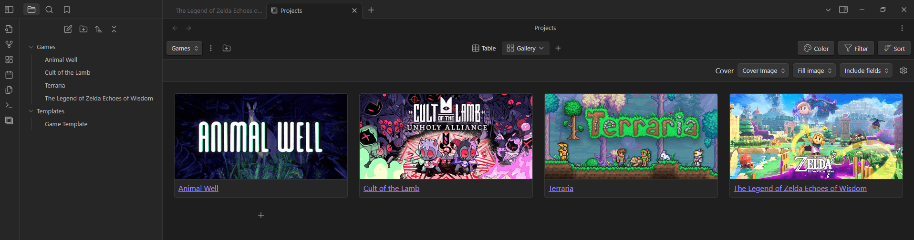

How it looks using way 2, "dataview" plugin with custom styling via CSS snippets:

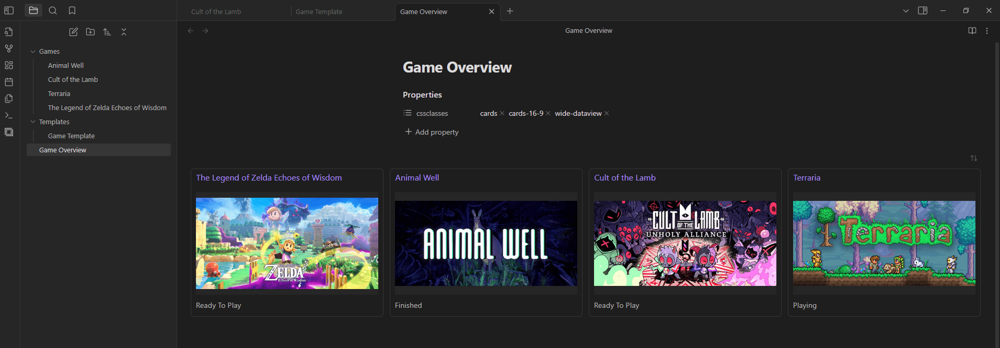

You can also use both of these methods with no additional overhead other than setting them up both.

## Getting started
Start by creating a new Vault, or by creating a new folder in your existing Vault.  
Add a folder in which you will be adding the games, each note in that folder represents one game.

You will want to create a template for these game entries. In this template we want to define the metadata that each game entry will use. In this example I will use the following properties: `Creation Date`, `Type`, `Cover`, `Status`, and `Game Tags`.

To create the template create a folder, then create a new note within that folder with the following content:

```
---
Creation Date: {{date}}
Type: Game
Cover: 
Status: 
Game Tags:
---
```

The template would then look like this:
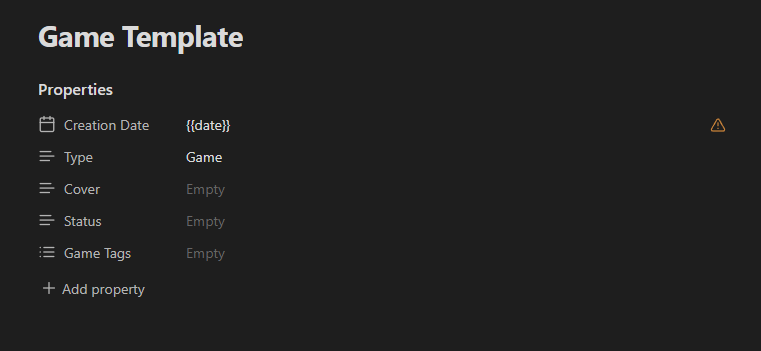


The property type of all of these will be `Text`, with the exception of `Game Tags` which is a `List`.

In the settings under "Core Plugins" define the location of your templates folder, in my case it is "Templates".

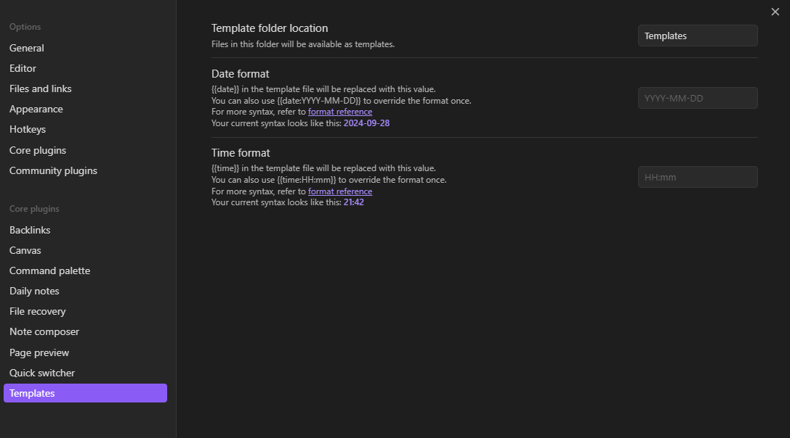

By going to a game note and pressing `ctrl + p`, then searching for `Templates: Insert template` you can insert the template. It's also possible to choose a custom shortcut to insert templates in the Obsidian settings.

After inserting the template and filling in the relevant information for the game your note could look like this:

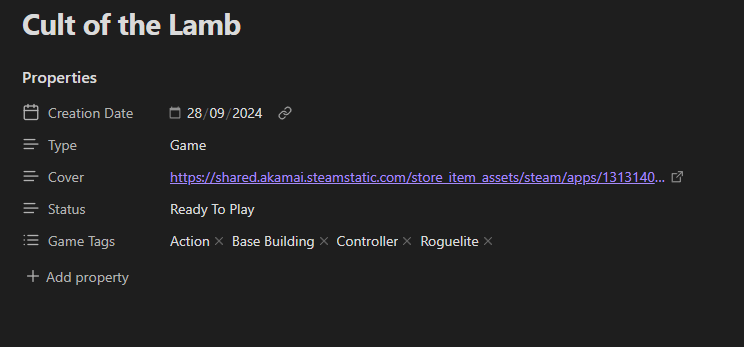

For the cover image I like to usually use the Steam capsules of the game. You can get the link to them by opening the steam store in the browser and right clicking the capsule image to select `open image in new tab`, then copy the link at the top.

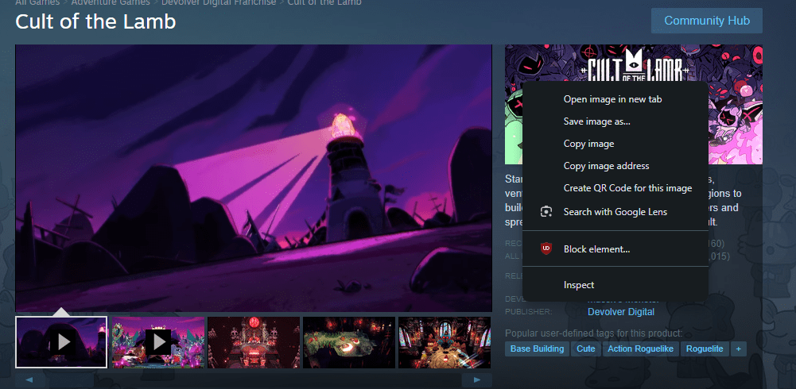

But you can use any image, you can enter online links like I did or use local images that you have downloaded.

For status I like to use these 4: `Ready To Play`, `Playing`, `Finished` and`Stopped`.  
For game tags I use the tags that describe the game in a way that is relevant to me personally.

Now we got our first game entry! But how do we display them in a pretty way? How can we filter them and show the games that we want to see?

## Using the "Projects" plugin
A simple way for managing your game entries is by using the "Projects" plugin.

Download a community plugin by first enabling them, then downloading `Projects` by Marcus Olsson and then activating it in the `Community plugins` tab inside your settings.

Now right click the folder that contains your game entries and select `Create project in folder`. Use the default settings.

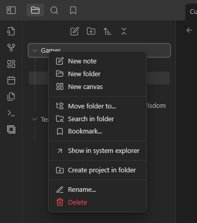

Now you can click on the `Open projects` icon on the far left. You will get a view that should look somewhat like the following. 

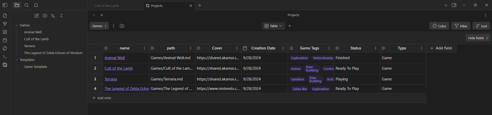

The Projects plugin allows us to adjust this table however we want. We can also apply filters. You can sort them however you want, or filter by the `Game Tags` you have added.

One view that might be a bit cooler than the Table view is the Gallery view. Add a new view by pressing the plus button near the center, select `Gallery`.

To display each note with its corresponding cover image select `Cover`on the top right, then select `Cover Image`. Now it takes the image we have added on each note in the `Cover Image` property and displays it in this gallery view.


Now we are done! Looking for a new game to play? Sort through your game notes by filtering to `Ready To Play` only. Add additional properties like `Interest` to list games that interest you more higher.

## Using the "dataview" plugin with CSS snippets
Another way to display the game entries can be achieved by using the `Dataview` plugin and CSS snippets.

Get the `Dataview` plugin and activate it.

Create a new note (**not** part of the Games or Template folder) and call it "Game Overview", or whatever name you'd like. Inside this note we are going to display all of the games.

Then add the following code:

````
```dataview
TABLE "" AS "Cover", status
FROM "Games"
```
````

How it should look in source mode:

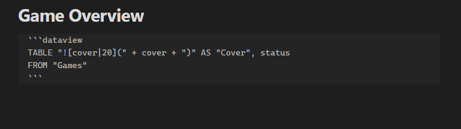

How it should look in reading mode:

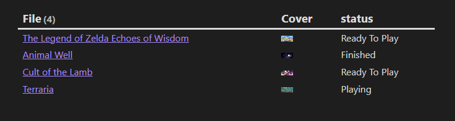

As you can see, the images are a bit too small and everything is displayed as a table, we don't want that. We can change this by utilising CSS snippets, this allows us to change how content is shown without changing the actual content.

We will use two snippets: Cards and Wide Views.  
Download them: <a href="/documents/Obsidian-Cards-Snippet.css" download="Obsidian-Cards-Snippet">Cards Snippet Download</a> & <a href="/documents/Obsidian-Wide-Views-Snippet.css" download="Obsidian-Wide-Views-Snippet">Wide Views Snippet Download</a>.

<small>The content of these CSS files came from the Obsidian community forum: [Dataview Cards snippet discussion](https://forum.obsidian.md/t/snippet-so-you-can-use-dataview-cards-from-minimal-theme-in-any-theme/56866/5) and [Modular css layout Github](https://github.com/efemkay/obsidian-modular-css-layout)</small>.

Go into settings, then `Appearance`, then scroll down and include these two files in the `CSS snippets` folder. Reload and activate them.

Add the property `cssclasses` to the note where you want to display the backlog of your games. Add the text `cards` and `cards-16-9` to this new property.

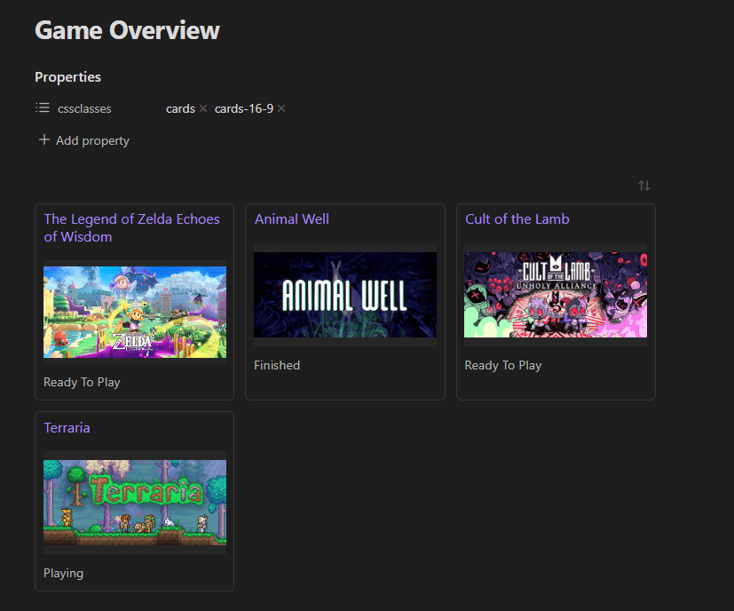

Now we are mostly finished! This list shows all entries you have included in your folder with an image that's sized for human eyes. 

But we haven't used the `Wide Views` CSS snippet yet. So what do we use it for? Well, for, for wide views!

Include `wide-dataview` (and make sure both CSS snippets are active in the settings) and voilà! Less wasted space, I think this makes this view much nicer.


If you want to use additional filters we have to include them in the dataview code. For example if you want to display Games which you are currently playing you'd use this code:
````
```dataview
TABLE "" AS "Cover", status
FROM "Games"
WHERE status = "Playing"
```
````

ChatGPT or any other LLM tool can be very helpful in writing these filters if they are confusing to you :)

And that's it! 🎉 Enjoy your game library in Obsidian!

## More? Book backlog?
As you might have already noticed the system is very flexible and you can include anything you want, it's not limited to games. I am also using this system for an overview of all the books I have and want to read.

If you don't feel ready yet to actually play your games or read your books yet you can spend further time on your setup.  
Here are some suggestions on how you can enhance it:
- The [Game Search Plugin](https://obsidian.md/plugins?id=game-search). With it you can quickly make new game entries and automatically add metadata information such as release date, publisher, Metacritic score and more.
- Using the [Metadata Menu Plugin](https://obsidian.md/plugins?id=metadata-menu). With it you can build custom interactions to adjust and manage the metadata of your notes, but it's a bit complicated.

I don't use the Game Search Plugin as I don't find the information it adds useful, but I do use the [Book Search Plugin](https://obsidian.md/plugins?id=obsidian-book-search-plugin).