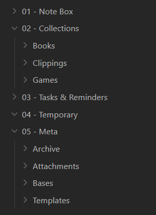
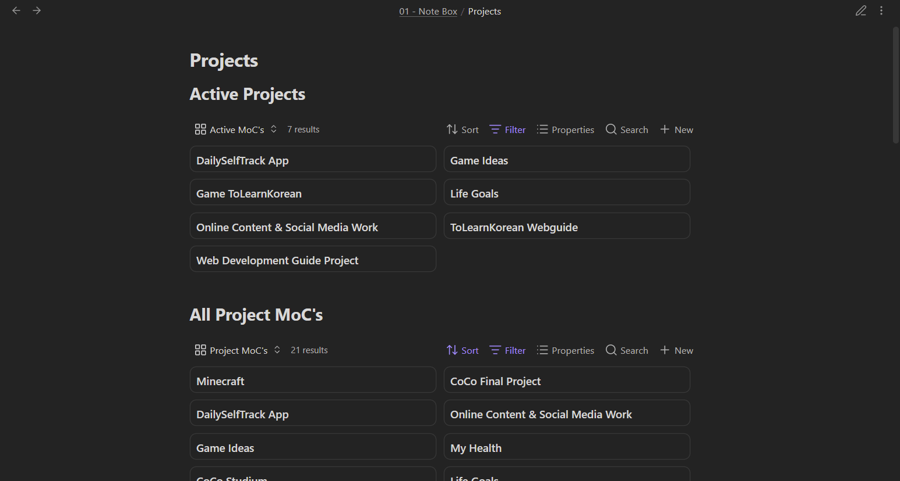

I've been using Obsidian for many years now and I enjoy it a lot, for me it's very helpful. Obsidian can be highly customized, and that's great. Important for me is that my Obsidian vault supports me in doing other work, and I've found a system that works well. So what does it look like?

My whole [vault template is available on GitHub](https://github.com/BryanHogan/obsidian-vault-template). (Currently some elements mentioned here are still missing, work in progress)

> I significantly changed this setup in 2026 and updated this post to reflect my current system.

## What I use my Obsidian vault for

I use my Obsidian Vault for a lot of things: 
- For writing content such as my blog posts or [monthly e-mail newsletter](/follow).
- For collecting, summarising and preparing information.
- For managing projects, and other aspects of my life such as my health.
- For collecting information on books, video games, YouTube videos and more.

## Rules for a simple, long-lasting setup

These are the rules I set myself:
- **Keep it simple.**

Some additional rules:
- Avoid using multiple Vaults.
- Minimise folder usage.
- Avoid non-standard markdown.
- Prefer to pluralize tags and links.
- Use dates in `YYYY-MM-DD` format.

I try to avoid unnecessary modifications and prefer a simple long-lasting system, so I'm careful about any plugins and CSS snippets I add. I use the basic dark theme of Obsidian.

## Vault structure

1. **Note Box** - Contains my knowledge notes, my thoughts and learnings, as well as notes for projects I'm working on.
2. **Collections** *(Contains: Books, Clippings, Games)* - First folder that uses sub-folders, each sub-folder contains notes belonging to the specific area.
3. **Tasks & Reminders** - Things to do and get done for this month.
4. **Temporary** - Notes which are needed only for a very-short period of time.
5. **Meta** *(Contains: Archive, Attachments, Bases, Templates)* - Also uses sub-folders. `/archive` includes retired notes. `/attachments` is for media included in notes such as pictures, videos and audio. `/bases` for the `.bases` files of Obsidian which are then used in notes. `/templates` for the template files used to prefill different kind of notes.

I prefer this approach of 1) notes from my thinking / knowledge work 2) collections of media and other external content 3) what I want to get done for the month over PARA or other structures. (*In the following sections I sometimes drop the numbering when mentioning a folder, `/Note Box` and `/01 - Note Box` is the same*.)

## Note Box: Smart notes & bottom-up note-taking

The `/Note Box` folder is the most important folder of my Vault.

It contains:

- Long-lasting knowledge notes - These notes are of type `Zettel`, they should explain one concept (atomic) and link to relating concepts.
- Notes which are less long-term, these are of type `Project` - These usually belong to a project or problem that can end.
- Other note types such as `Blog Posts`, `Scripts` and `Locations`

Notes reference other notes via linking, so via `[[ ]]`. I use a pre-set template of properties depending on the type of note. For `Zettel` notes I add links to files that might not exist yet, e.g. `[[Korean]]`. Project notes link to the project they belong to.

By doing this I will find that some notes belong together, as they reference the same topic. I then create a `MoC` (Map of Content) note which provides an overview of notes linking to it. With this approach groups and structure form naturally, as notes can belong to multiple different groups. For knowledge notes this is great, as topics form naturally.

Project notes show up in the project overviews (using Bases) when they are of type `Project`. MoC files specifically for projects include a link to `[[Projects]]`, making them show up in the overview there.

If you are new to taking "smart notes" / "evergreen notes" / "Zettelkasten notes" / bottom-up notes I recommend my post going 
into [further details on taking smart notes](/blog/obsidian-zettelkasten).

## Collections: Books, games and more

Knowledge and project related notes go into `/Note Box,` but what about games and books?

### Books

Each book that I want to read, am reading, have read or stopped reading is stored as a note in `/Collections/Books`. With Bases I can easily create overviews of these book entries and sort & filter them. These overviews are included and linked to from the folder note that opens up when I click the book folder.

Each book note includes a chapter overview, plus a quick summary, notes on who it's worth reading for and how it has helped me. Although I'm not consistently adding this information, which is okay since this is just for me. Knowledge from books is added to `/Note Box`.

Sometimes I want to link to a specific Zettel note from the chapter overview of a book, so knowing the link name can be different from the note it is linking to is very helpful here, e.g. `[[actual note name|name thats shown]]`.

### Games

This `/Collection/Games` folder is very similar to the one for books, but instead for video games.

### Clippings

Using the [Obsidian Web Clipper](https://obsidian.md/clipper) I sometimes add content from the internet to my vault. I usually do this when I want to reference it later on, or use it as a base to create some Zettel from it. By adding it to the vault I can be sure that it will be there when I need it again in the future, remember that websites might be taken offline or changed at any time.

## Templates I use

Templates allow me to pre-fill notes with relevant properties / frontmatter. Templates are part of core Obsidian, you just need to enable them and also set a hotkey to insert them.

- `/Note Box` uses the following templates: `Zettel`, `Project`, `Blog Post`, `MoC`, `Script`
- `/Collections/Games` uses the following template: `Game`
- `/Collections/Books` uses the following template: `Book`
- `/Tasks & Reminders` uses the following template: `Tasks & Reminders`

## How to navigate & rediscover information

Obsidian has something called ["Bases"](https://help.obsidian.md/bases). These allow you to display your notes in different views, e.g. a table, list or card view. Bases allow you to filter and sort these views in any way you like.

I use these Bases in combination with the FolderNotes plugin. This allows me to create overview pages for when I click on my `01 - Note Box` or `02 - Collections` folders. These overview notes include Bases that list all relevant MOC's (Map of Contents), active projects, and then other relevant content that I want to access, ending with a complete list of all notes in that folder.

By creating links within notes, creating MOCs that utilize Bases, and just the general text search in Obsidian I'm confident that relevant information in my vault doesn't get lost, especially since most of my knowledge uses the bottom-up approach described above.

## Plugins I use

I try to use a minimal amount of plugins, especially community plugins. Each plugin introduces complexity, risks, longer loading times and can generally make your system less future proof.

I use the following community plugins:

- [FolderNotes](https://github.com/LostPaul/obsidian-folder-notes) - Make a note belonging to a specific folder, clicking that folder opens the note.
- [Filename Heading Sync](https://github.com/dvcrn/obsidian-filename-heading-sync) - I don't display the file-name as the heading in Obsidian, turned that off in the settings. Instead I use a `#` at the beginning of each file. This plugin syncs that h1 heading with the file name.
- [Language Tool Integration](https://github.com/Clemens-E/obsidian-languagetool-plugin) - Spelling checker.
- [Periodic Notes](https://github.com/liamcain/obsidian-periodic-notes) - For the monthly Tasks & Reminders note.

As of version 2.0 of my vault I now longer use [Lazy Plugin Loader](https://github.com/alangrainger/obsidian-lazy-plugins), [Home Tab](https://github.com/olrenso/obsidian-home-tab), [Book Search](https://github.com/anpigon/obsidian-book-search-plugin) or [Dataview](https://github.com/blacksmithgu/obsidian-dataview).

## Styling & themes

The default dark theme of Obsidian works well for me, so I'm using that.

I don't use any CSS snippets.

## More about Obsidian

### For writing my blog posts on the web

I use Obsidian to write the content for my personal website as well. This website has been built with Astro. There are many static site generators that can take markdown files to create web pages.

For more information on [how to use Obsidian to create a website look here](/blog/obsidian-website).

Then I found using a separate GitHub repository as a submodule for Astro to be a good approach for writing markdown for your website anywhere, I wrote about that [GitHub submodule approach here](/blog/obsidian-astro-submodule).

### Syncing my vault across desktop and mobile

Obsidian works on both desktop and mobile. Since Obsidian is actually just a collection of markdown files any file sync or cloud service can be used. I back-up my vault from time to time to a personal GitHub repository. For synching I use Google Drive, this includes the Google Drive Desktop program I use on Windows, and the DriveSync app on Android.

I wrote a more [detailed comparison of different ways to sync Obsidian and the setup I use here](/blog/how-to-sync-obsidian). 

### Obsidian or something else?

There's many note-taking applications out there, but for me Obsidian is definitely one of the best. But it's not the only one I use, as different programs have different use-cases. I have a more detailed comparison of [Obsidian vs Notion here](/blog/notion-obsidian-comparison).

So I not only use Obsidian, I use Notion and Logseq as well. Notion for content that is collaborative or that can use the better Database function there, e.g. the Kanban in Notion is great. Logseq for short daily notes, as having a separate program for quick notes feels better and daily entries in Logseq are shown in an infinite scroll-able vertical view, which makes it easier to find past entries.

Other note-taking applications that might interest you:

- [Capacities](https://capacities.io/) - Web-based markdown-based note-taking tool, similar to Obsidian.
- [Affine](https://affine.pro/) - Self-hostable note-taking tool, similar style to Notion, introduces whiteboard views.
- [SiYuan](https://github.com/siyuan-note/siyuan) - Self-hostable note-taking tool, similar to Notion.
- [Logseq](https://logseq.com/) - Open-source note-taking tool, markdown-based but makes everything into lists, overall lower quality than Obsidian.

## Recent changes - Version: 2.0

The vault you see described in this post is my most recent version. It's simpler and makes heavier use of the `Bases` feature.

What changed?

I moved `Zettel` and `Project` notes into one combined folder. I also moved blog posts, video scripts and location notes into this combined folder. That combined folder is now called `Note Box`.

The properties have also been updated, using overall less and more of them are shared between different note types. All templates have been updated accordingly.

The Dataview plugin has been removed and `Obsidian Bases` are used more throughout the whole vault for creating structure.

Periodic Notes is a new plugin, using it for keeping a monthly note of things to do.

All of these changes help to make this vault setup more pleasant to use, reducing decision fatigue and just further helping you get more work done outside of your vault.

---

Further Links 💡

- Obsidian vault tour of the current Obsidian CEO: https://stephango.com/vault

