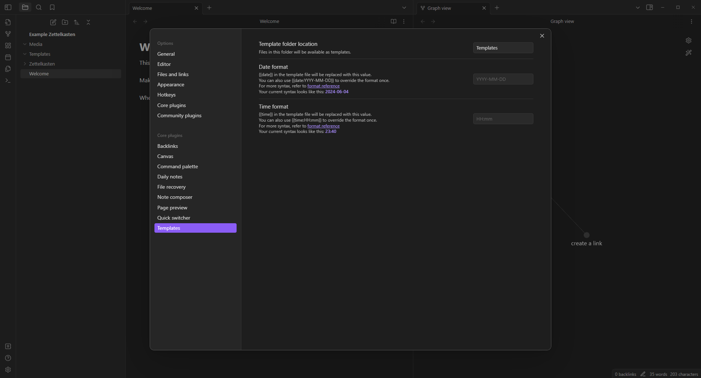
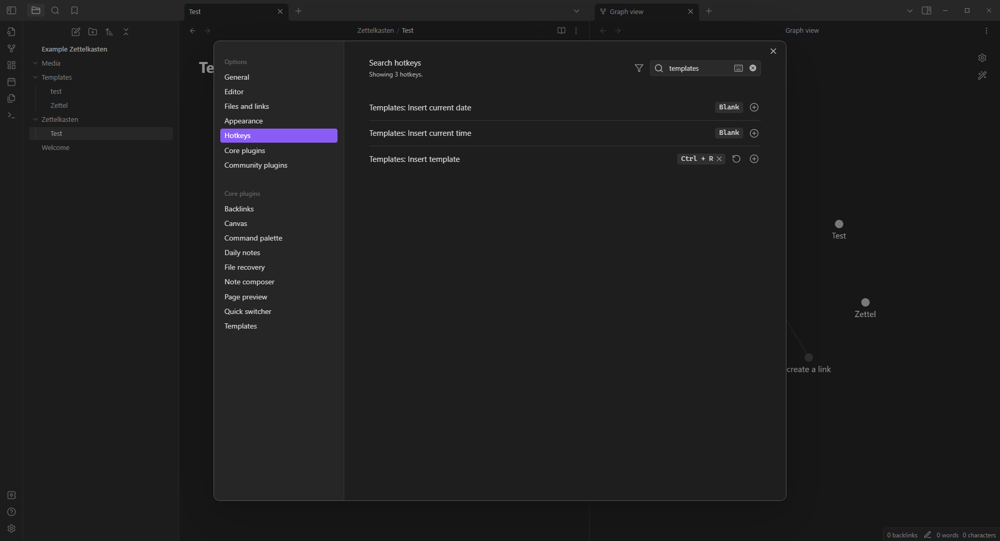
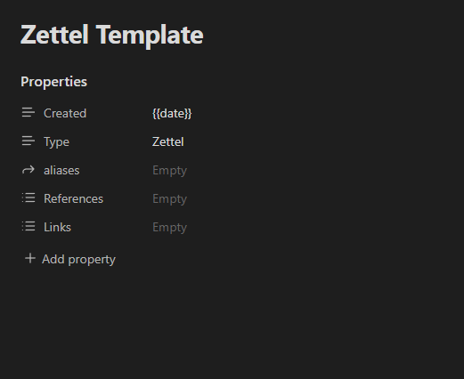
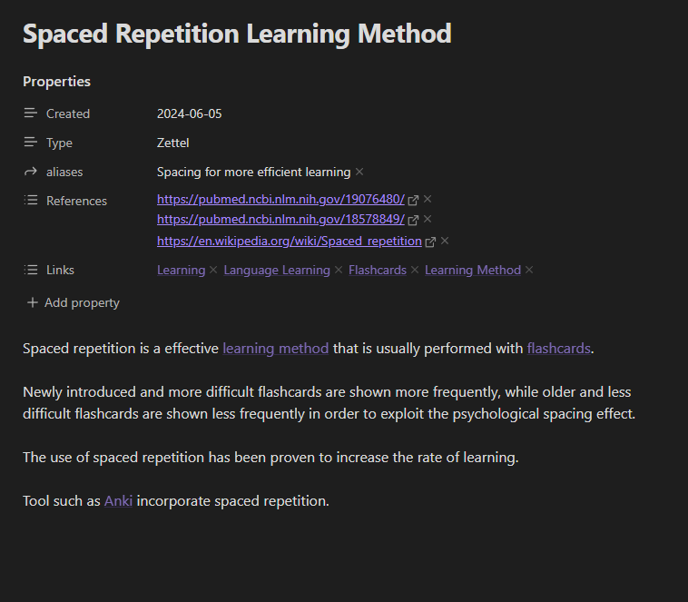
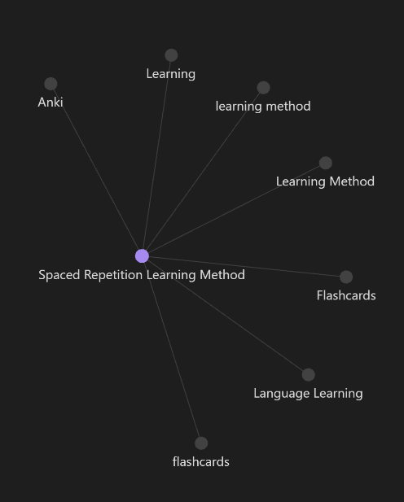
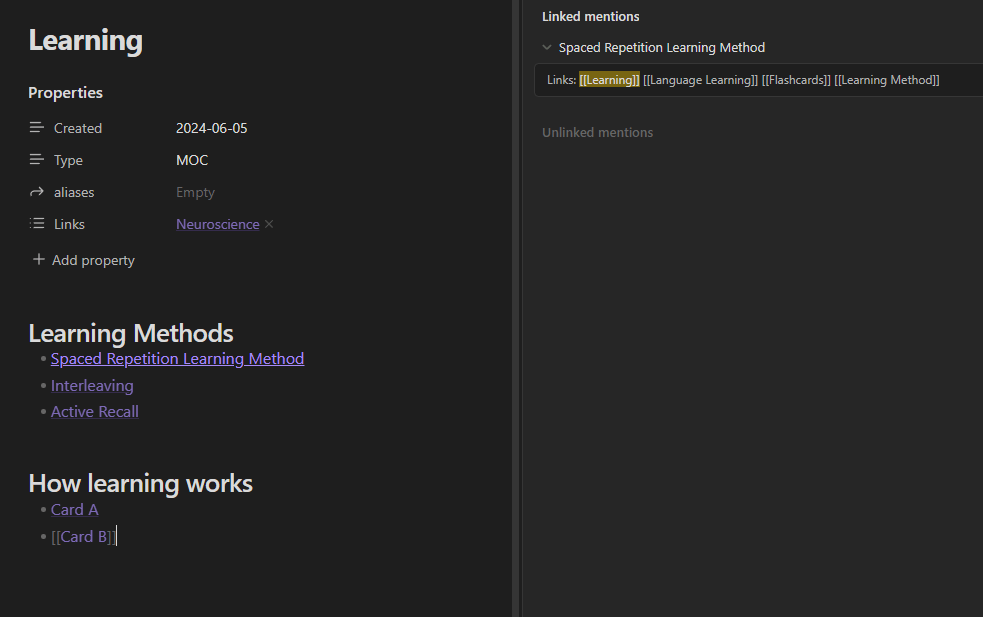

Create a second brain. The life-long note taking system Zettelkasten.

## What is a Zettelkasten?
Zettelkasten, or also sometimes called "Luhmann’s slip-box"(?), "evergreen notes" or "smart notes" is a system for life-long note taking. It is a system to store your notes in a way that scales for your whole life. All of your information is stored in an accessible way, a second brain.

Traditional note taking setups are top-down. You define a category, either the name of a folder, the name of a Notion page/section or the name of your textbook. Then later on you add notes relating to that topic within that defined group.

Zettelkasten is instead bottom-up. You start with the information itself. You write a card (= Zettel = slip = note) that contains information about one thing. This card then references / links to other cards. By then adding more information into your Zettelkasten you will see groups of information form naturally.

## What is the benefit of Zettelkasten?
The benefit of a Zettelkasten is that you only need one for your whole life. It is a single system that can contain all the information you want.

In a traditional top-down note-taking setup you will run into problems. It will get hard to categorise cards / information that could belong into multiple categories. It is hard to adjust the structure with new insights. Old notes get lost or abandoned.

With a Zettelkasten system you can quickly add any new information. That information won't get lost. New insights can build reference to older ones. Links to new information and general topics can easily be added to even old notes.

## How to create a Zettelkasten
A great tool often used for building a Zettelkasten is Obsidian. It is a writing program that allows you to build links between your notes.  
It is possible to build a physical Zettelkasten as well, but using a digital one makes things much easier and more efficient.

Too often tutorials about making a Zettelkasten get too long, so here I want to focus on only what matters.

Get started by downloading Obsidian and creating your first Vault.

### Getting started
In the Obsidian Vault we want to create three folders:
1. Zettelkasten
2. Templates
3. Media

In `Zettelkasten` we will store all our cards (you can also call them Zettel, notes or slips).  
In `Templates` we will store templates which we can use whenever we create a new card.  
In `Media` we will store media files, such as images, audio or videos.

There are a few settings we have to adjust.

Under `Settings -> Core plugins -> Templates ` we want to change `Template folder location` from empty to `Templates`.



Under `Settings -> Files and links -> Attachment folder path` select the `Media` folder.

Add a hotkey on how to insert a template:



I chose `Ctrl + R`.  
Now we need to actually create a template that we can insert.

A template is text that we can insert into new cards we create, instead of starting with a blank note we can insert a template into a new note/card to make things easier.

Let's create a new note in `Templates` with the name of `Zettel Template`.
Insert the following into this card (also copy the "---"):

```
---
Created: "{{date}}"
Type: Zettel
aliases: 
References: 
Links:
---
```

By inserting the text from above we should get something that looks like this:



We have just added frontmatter / properties to our card. This is special text that we can use to define properties of our card.

Click once on `References` and `Links` to change their type to `List` instead of `Text`.

What do these properties mean?
- **Created** - This is the date representing when the card was created. This is added automatically when we apply the template.
- **Type** - We will be adding a different type later. We can use this to distinguish between `Zettel`and `non-Zettel` cards.
- **aliases** - Here you can add an alternate title. This can make it easier to find your card later when you do a text search.
- **References** - Here we add references to where we found our information, like a link to a Youtube video, a book, a blog post, or wherever the information came from.
- **Links** - Here we add links to topics (concepts) the card falls under. More on this later.

Don't worry if things seem a bit confusing for now, it will get easier to understand with the example down below.

### Writing your first Zettel
Let's create a new note in our `Zettelkasten` folder by right clicking it and selecting the first option.

Insert the template (use the shortcut defined earlier).

- Notes should be atomic, meaning that each card is about one thing. This card then references other cards, similar to how a Wikipedia page works.
- Let structure merge organically. If you impose a structure from the start you constrain the nuanced relationship between ideas. Do **not** create folders in the `Zettelkasten` folder.  
- Write for yourself. Use your words and how you view things.

How do you link to other cards?  
You can create links by wrapping and words in these square brackets: `[[  ]]`.



This is an example of how your first card could look like. (Back when I first made my Zettelkasten my first few cards were about making a Zettelkasten itself.)

In the text area below the properties we write our information. This text uses markdown, meaning you can create headers with `#` or make text bold by wrapping it in `**  **`. If you want to know more about writing Markdown check out Obsidian's own page [explaining how to use Markdown](https://help.obsidian.md/Editing+and+formatting/Basic+formatting+syntax).

In this example I have created links to: `[[learning method]], [[flashcards]], [[Anki]]`. By clicking these links we land on that card. If that card does not yet exist a new one is created.

In the properties I added an alias, included references on where I heard about Spaced Repetition and included Links to overarching concepts.

### Map of Contents
By creating cards like earlier groups of information will organically grow.



The graph view in Obsidian is very cool. It visualises how different notes reference each other.

As more cards reference a specific concept or topic you will see that node grow. It might make sense to make it a "Map of Content" (MoC).

A MoC can work as a sort of overview for the cards that reference it. In the example above there might come a time where multiple cards have a link to `Learning` in their Links properties.  
In that case we want to make `Learning` a MoC.

Let's create a template to quickly create MoC's and then see how to apply it.

Create a new note in the `Template` folder and name it `MoC Template`. The template for a MoC could look like this:

```
---
Created: "{{date}}"
Type: MoC
aliases: 
Links:
---
```

This MoC template is similar to a Zettel template, just with a few unnecessary lines removed.

To create the card we click on `Learning` and can then insert our MoC template.  
In this map of content we can now create an overview of relevant cards. By clicking the chain icon with an arrow to the left we can also display all backlinks that mention this MoC card.



When your Zettelkasten is still small you won't really need MoCs, but they will come in useful as it grows in size.

This is all when it comes to creating a basic Zettelkasten.  
Obsidian offers a lot more options. It has many community built plug-ins, options for styling and layout, and much more. But that also makes it easy to get distracted. Especially in the beginning, focus on what matters and don't overplan.