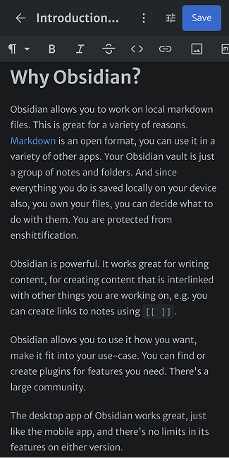
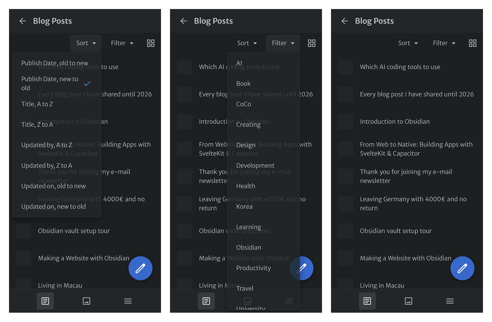

This blog is a [custom built Astro site](https://github.com/BryanHogan/bryanhogan). Every post is a markdown file.

I want to be able to write and edit my posts on mobile as well, after a bunch of disappointments I went with Sveltia CMS.

Sveltia CMS gives me an editing interface at `/admin` that reads and writes the markdown files directly through GitHub. No complex database or server, just the plain markdown files.

This post covers how I set it up and fixes to the problems I encountered.

## What is Sveltia CMS?

[Sveltia CMS](https://github.com/sveltia/sveltia-cms) is a git-based CMS, an improved fork from Netlify CMS / Decap CMS. It's a single JavaScript file that runs entirely in the browser and talks to the GitHub API. It's with one YAML file.

It commits directly to your repository on GitHub. I was able to just use my existing build pipeline.



## Basic setup

Two files in `public/admin/`:

`index.html` loads the CMS:

```html
<!DOCTYPE html>
<html>
<head>
  <meta charset="utf-8" />
  <meta name="robots" content="noindex" />
  <title>Edit</title>
</head>
<body>
  <script src="https://unpkg.com/@sveltia/cms/dist/sveltia-cms.js"></script>
</body>
</html>
```

`config.yml` tells it where the content lives:

```yaml
backend:
  name: github
  repo: BryanHogan/bryanhogan
  branch: main

media_folder: src/assets
public_folder: /assets

collections:
    - name: blog
    label: Blog Posts
    folder: src/content/blog
    create: true
    format: yaml-frontmatter
    slug: "{{slug}}"
    fields:
            - { label: Title, name: title, widget: string }
            - { label: Description, name: description, widget: string }
            - { label: Publish Date, name: pubDate, widget: datetime }
            - { label: Tags, name: tags, widget: list }
            - { label: Body, name: body, widget: markdown }
```

For authentication I use a GitHub personal access token. Sveltia CMS lets you sign in with a token directly. I just had to create a token within GitHub with read and write access to the repository and use it in the sign-in dialog.

## Matching the CMS fields to Astro's content schema

Astro validates frontmatter through a [Zod schema](https://docs.astro.build/en/guides/content-collections/) in `src/content.config.ts`:

```ts
schema: ({ image }) => z.object({
    title: z.string().max(65).min(10),
    description: z.string().max(162).min(50),
    coverImage: image().optional(),
    emoji: z.string().optional(),
    pubDate: z.date(),
    lastUpdate: z.date().optional(),
    tags: z.array(z.string().transform((tag) => tag.toLowerCase()))
})
```

The CMS fields mirror this schema:

```yaml
- label: Title
  name: title
  widget: string
  required: true
  minlength: 10
  maxlength: 65
```

This way validation happens while writing in the editor instead of failing the build later.

## Images and Astro's image optimization

Astro can optimize images at build time, but only when they live inside `src/`. Images in `public/` get served exactly as uploaded. So I store the original `.png` and `.jpg` files in `src/content/blog-assets/` and let the build turn them into optimized files.

The typical setup uploads images into `public/`, which would skip that optimization completely. To make Sveltia upload into `src/` instead, the blog collection gets these two lines:

```yaml
media_folder: ../blog-assets/images
public_folder: ../blog-assets/images
```

`media_folder` is where uploads land, relative to the posts folder. `public_folder` is the path the CMS writes into the markdown. With both set to the same relative path, an uploaded image ends up in `src/content/blog-assets/images/` and the post references it as `../blog-assets/images/Example.png`. Astro resolves that path relative to the post file and runs the image through its optimization pipeline.

One thing doesn't work out of the box: files inside `src/` are never served directly, so during development you can't open the raw images under a URL. A small Astro integration in `astro.config.mjs` fixes that by serving the folder on the dev server:

```js
function blogAssetsPreview() {
  const blogAssetsDir = path.resolve('src/content/blog-assets');
  return {
    name: 'blog-assets-preview',
    hooks: {
      'astro:server:setup': ({ server }) => {
        server.middlewares.use('/blog-assets', (req, res, next) => {
          const filePath = path.join(blogAssetsDir, req.url ?? '');
          if (fs.existsSync(filePath) && fs.statSync(filePath).isFile()) {
            fs.createReadStream(filePath).pipe(res);
            return;
          }
          next();
        });
      },
    },
  };
}
```

It doesn't move or copy any files. It just answers requests to `/blog-assets/...` by reading the matching file from `src/content/blog-assets/`.

## Fixing the mobile editing UX

There are some issues with Sveltia's UI that degrade the UX. One of these issues was three sticky bars that take up way too much space.

I fixed this with custom CSS and a small script in `admin/index.html`. The CSS collapses the secondary toolbars on mobile, the script adds a toggle button to bring them back when needed:

```css
@media (max-width: 768px) {
  #first-pane-header .sui.toolbar.secondary,
  .sui.text-editor .sui.toolbar {
    max-height: 0;
    overflow: hidden;
  }

  body.toolbars-visible #first-pane-header .sui.toolbar.secondary,
  body.toolbars-visible .sui.text-editor .sui.toolbar {
    max-height: 60px;
  }
}
```

```js
const observer = new MutationObserver(() => {
  const primaryToolbar = document.querySelector(
    '.content-editor .sui.toolbar.primary .inner'
  );
  if (primaryToolbar && !document.querySelector('.toolbar-toggle')) {
    const btn = document.createElement('button');
    btn.className = 'toolbar-toggle';
    btn.textContent = 'tune';
    btn.addEventListener('click', () => {
      document.body.classList.toggle('toolbars-visible');
    });
    primaryToolbar.appendChild(btn);
  }
});
observer.observe(document.body, { childList: true, subtree: true });
```

You can find my `index.html` file that Sveltia uses [here in the GitHub repository](https://github.com/BryanHogan/bryanhogan/blob/main/public/admin/index.html).

The MutationObserver is needed because Sveltia renders its UI after the page loads, so there is no toolbar to attach the button to at first.

I also made the formatting toolbar scroll horizontally instead of wrapping into multiple rows:

```css
.sui.text-editor .sui.toolbar .inner {
  flex-wrap: nowrap !important;
  overflow-x: auto !important;
}
```

These selectors are Sveltia's internal class names, so they can break with updates. Hopefully the updates fix these issues, or I will update this post with the new fix.

## Issue: empty optional frontmatter fields

My schema has optional fields like `lastUpdate: z.date().optional()`. When you save a post in Sveltia and leave an optional field empty, it still writes the field into the frontmatter as an empty string:

```yaml
lastUpdate: ''
```

An empty string is not a valid date and not an absent field, so the Astro build fails. The fix is one option in `config.yml`:

```yaml
output:
  omit_empty_optional_fields: true
```

With this, fields marked `required: false` that are left empty get dropped from the frontmatter entirely. See the [Sveltia data output docs](https://sveltiacms.app/en/docs/data-output) for the other output options.

## Viewing and sorting my blog content

Now that I have written a good amount of blog posts I also want to view them in a way that makes sense, most of the time that means by publish date.



In Sveltia I found it easy to adjust the config to add new options of how I want my content sorted or filtered:

```yaml
sortable_fields: [pubDate, title]
view_filters:
    - { label: Obsidian, field: tags, pattern: obsidian }
    - { label: Development, field: tags, pattern: development }
  # one per tag
```

## Was it worth it?

There are still some more issues with Sveltia, e.g. for some reason it disabled right clicking?

But for now I found it to be the best approach for when I want to edit markdown content that's on my website.

My current workflow consists of first writing posts in Obsidian (see my [Obsidian introduction post](/blog/obsidian-introducion) and my [Obsidian setup post](/blog/obsidian-vault) for more information) and then moving them over to the repository. Whenever I want to edit a post that has already been published I then use Sveltia CMS.

My full config is in [this blog's repository (`/public/admin`)](https://github.com/BryanHogan/bryanhogan).
