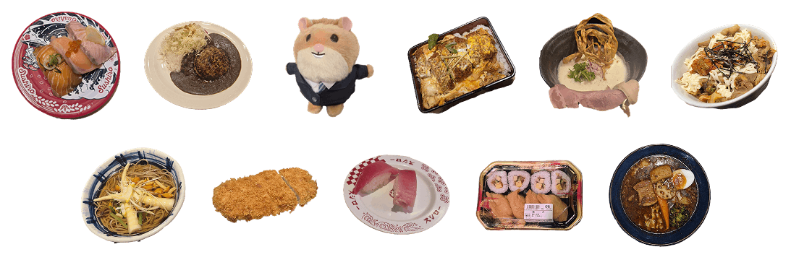
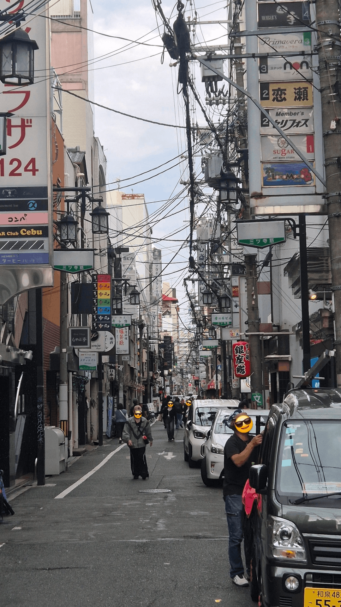

I just finished my Working Holiday in Japan. I stayed in Osaka and Tokyo. So what was my life there like and what do I recommend?

## Why go to Japan

I was born and grew up in Germany, but after a total time of almost 2 years in South Korea which I did really enjoy I wanted to see other countries around Asia as well. So after I got [my degree in Germany](/blog/what-is-coco) I [started a nomadic life](/blog/new-chapter-nomadic-life), [I worked in Macau](/blog/living-in-macau), traveled in Mainland China a bit, and then came to Japan on a Working Holiday visa.

Japan seemed like a great place to live in, and now I know that it really is.

## Where I went

I took the ferry from Busan to Fukuoka, and after a few days there I went to Osaka. I found work at a hostel in Osaka near Namba, I would work there, clean up and do the beds, and in exchange I could live there.

At the same time my first larger freelance project began where I worked on creating an app for my client, taking over development and design tasks.

After a few weeks at the hostel I didn't feel that comfortable of staying there for longer, the room was very small, I couldn't stand straight in it usually, the floor was not flat, there was no sunlight, it was noisy because of the constant pipe sounds, the air was very dry, I didn't have any space to work on my laptop, the hostel work took up more time than I expected, and the room was shared with another person who was also on a Working Holiday visa.

So I looked for a new place, luckily these days there are many medium-term furnished apartment rentals in Japan for foreigners. I'll talk more in-depth about these further down.

I found a great apartment in Bentencho, I liked it so much I even extended my stay there.

After that time in Osaka I went to Tokyo.

## Japan preparation

### Things to prepare before going

1. **Travel Health Insurance** - Make sure your health insurance covers you for long-term stays, usually basic travel insurances in Germany only cover up to 2 months abroad.
2. **Bank card** - Get a card that works abroad, a found Revolut much better than any German bank I used.
3. **Vaccinations** - Talk to your doctor about what vaccinations you need.
4. **Cash** - Get cash before or after arriving. Some restaurants require you to pay in cash. Often I could use my Revolut visa card though. Sometimes I could use the IC card for paying as well.

### Things to get when you arrive in Japan

1. **IC Card** - The rechargeable card for taking public transport. Depending on which region in Japan you are in they might have a different name, but just get any at a nearby Konbini or bigger train station and charge it with cash at the machine.
2. **Residence registration** - You'll need to go to the citizens office to register your address and to get a residence card.
3. **Japanese phone number** - You will need a Japanese phone number for many things, e.g. for creating your Line account. For the good phone plans you'll need a residence card, so get that before you go.

Japan has many big supermarkets such as Life (my favorite), Aeon, Oasis, Daiei and many more which probably sell all the food you need. Daiso and Don Quijote are also worth a visit, they both sell a wide range of products.

### App to use in Japan

1. **Google Maps** - The app which is commonly used for navigation in Japan. 
2. **Google Translate** - For translating, you can also take pictures of menus for example and get them translated.
3. **LINE** - The messaging app commonly used by Japanese.

I also recommend learning some Japanese! Start by learning how to pronounce common phrases, as learning the alphabets beforehand might take some time.

## My favorite restaurants

The places mentioned here are almost all chains which you can find all over Japan, including both Tokyo and Osaka.

**Curry:** Joto Curry & CoCo Ichibanya

**Soup curry**: Sapporo Soup Curry Jack

**Soba**: [Toriso Zagin Niboshi](https://maps.app.goo.gl/XUngFwFLN3ZipDfz5) (Only in Osaka)

**Sushi**: Sushiro (Go to the ones that have the big screens, for example [this Sushiro in Dotonbori](https://maps.app.goo.gl/R21xs24nA45vPiXaA)) & Kura Sushi

**Ramen**: There's so many good ramen stores I'm not sure where to start. Just go to what's close to you.

**Tonktasu**: Tonkatsu Kagurazaka Sakura

**Good price**:
- Sukiya
- Yoshinoya
- Matsuya
- Cafe Gusto: International and Japanese food for a good price served by a robot with cat ears, including spaghetti, pizza and Korean-inspired dishes.

## Things I enjoyed in Japan

I really loved my time in Japan. There are so many delicious restaurants that are not too expensive, I was able to go out and eat every day. Being able to go eat together with people regularly is amazing. People outside are respectful and public order is upheld well. Public transport is good. Japanese Konbinis (convenience stores) are great. There is a lot to do and see, both Osaka and Tokyo had many activities and events going on, and the nearby nature is gorgeous, I wish I could have stayed longer.

My two favorite areas in Osaka were Dotonbori / Namba and Umeda.

In Tokyo there were so many amazing areas that I couldn't visit them all.

## How to find housing in Japan

There are many options for medium-term housing for foreigners in Japan. These platforms list multiple options on their website which can be rented with a minimum renting time of 1 month.

I had a very positive experience with the two apartments I had found, they were incredibly good, clean and comfortable.

However, these agencies will charge you extra for being a foreigner and using services in English, even if you don't need them. I also experienced one company trying to rip me off massively me at multiple occasions.

Websites I or my friends had used:
- https://apartment-japan.com/
- https://www.athome.co.jp/corporate/en/
- https://www.ur-net.go.jp/chintai/sp/kansai/osaka/
- https://www.good-monthly.com/
- https://apj-unilease.com
-  https://atinn.jp/en - Mixed experience, good apartment but sometimes tried to rip me off. Also they removed their online listings?
- https://x-house.co.jp/en/osaka/ (not sure from where this recommendation)
- https://hmlet.com/en - High prices but other than that solid experience.
- https://mooovin.jp/en/
- https://shares.house/L_en/ - Share houses not apartments actually.

I'm not explicitly recommending any of these, especially since they might have changed since I list looked through or heard about them. If you can't read Japanese use your browsers translate page feature and the Google Translate Images function, not everything will be in English on these sites.

## Finding work in Japan

On a Working Holiday visa you can work in Japan. What type of work is available to you massively depends on your Japanese language ability.

I speak English but no Japanese, if you are in a similar situation what can you do?

What I started with was doing one of the "volunteer" jobs through [Worldpackers](https://www.worldpackers.com/) or [WorkAway](https://www.workaway.info/). Which as described earlier, was doing cleaning and miscellaneous work at a hostel in exchange for living there.

I then had a big freelance project with a client in Germany which I wanted to focus on so I moved into my own apartment. But there are other options for working locally.

If I hadn't had that project I was also considering going to one of Japan's ski areas during the winter as a lot of seasonal jobs open up there.

If you are looking for work consider going to one of the job centers. During the Expo in Osaka they had many foreigners working there in various service jobs.

I joined a co-working space in Osaka, many of the people there were working remotely for their company back in Europe or America or working as a freelancer (like I did).

Can recommend [this video on finding an IT job in Japan](https://youtu.be/V149PNREv5A) and [TokyoDev's posts on this topic](https://www.tokyodev.com/blog/categories/job-hunting) if you are looking for a long-term (tech) job. As with most jobs, having a good network of people you know helps you massively when looking for work.