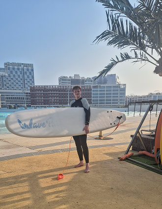

<h2 class="text-align-center">About Bryan Hogan</h2>

I'm Bryan Hogan, a (Web) Developer, Digital Creator and Blogger.  
Soon to be graduate in Code & Context, a modern interdisciplinary B.Sc. study in Cologne that combines the fields of computer science, design and entrepreneurship.

I have recently spent a year abroad in South Korea, studying at different universities. At the beginning of my stay abroad I also started with [BryanHogan.com/blog](/blog), a place for me to share all the things I would have loved to know about before I knew about them.

I also run a [monthly newsletter](/follow) called "Bryan's Briefing" since the beginning of 2024 in which I share what I'm up to, cool insights I've recently had and other amazing content I came across.

Take a look at my [Now page](/now) to see what I'm currently doing.

<h2 class="text-align-center">About Bryan's Blog</h2>

My blog "Bryan's Blog" is about topics that interest me, all with the aim to also help you. From health-related topics such as understanding sleep, to sharing cultural insights and achieving personal goals. I want to share my journey and learn alongside others.

**What I Value & How I Think:**

- 🌱 - There's special meaning in building a great future for yourself and others.
- ❤️ - To life happily in the future you need to be healthy.
- ⏳ - We all have ambitious goals, but how do we reach them?
- 📣 - There's already amazing content out there, and I'm eager to share it.
- ⚙️ - Modern thinking and building requires some technology. I also just love building digital experiences.

