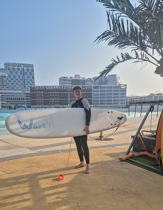

<h2 class="text-align-center">About Bryan Hogan</h2>

I'm Bryan Hogan, a developer and designer. I studied a mix of code, design and entrepreneurship and have been working in this field ever since.

My decision to go study abroad in Korea was one of the best I ever made. Since then I have spent many days outside of Germany, living as a digital nomad and working in countries such as Macau, Japan and Australia.

I started my blog [Bryan's Blog](/blog) during 2023 while in Korea, and now it's a place for me to share all the things I would have loved to know about before I knew about them.

I write about building digital products, web development, intentional digitalism and balanced productivity. I aim to write content that is helpful and for the intellectually curious, e.g. content about [Obsidian](/tags/obsidian), [Creating](/tags/creating) or [Korea](/tags/korea). See my [blog introduction](/blog/blog-introdiction) for more information about my blog.

Other writing I have published is part of my [web development guide](https://webdev.bryanhogan.com/) or my [guide to learn Korean](https://tolearnkorean.com/).

I also run a [monthly newsletter called Bryan's Briefing](/follow) since the beginning of 2024 in which I share what I'm up to, cool insights I've recently had and other amazing content I came across.

I graduated in [Code & Context](/blog/what-is-coco) in Cologne in 2025, but knew that after the year in South Korea that I wanted to go back and see more of the world. I [started a nomadic life](new-chapter-nomadic-life) and lived in Korea, Macau, China, Japan and Australia.

I also have a [Now page](/now) with updates on what I'm currently up to.

<h2 class="text-align-center">About Bryan's Blog</h2>

My blog "Bryan's Blog" is about topics that interest me, all with the aim to also help you. From health-related topics such as understanding sleep, to sharing cultural insights and achieving personal goals. I want to share my journey and learn alongside others.

**What I Value & How I Think:**

- 🌱 - There's special meaning in building a great future for yourself and others.
- ❤️ - To life happily in the future you need to be healthy.
- ⏳ - We all have ambitious goals, but how do we reach them?
- 📣 - There's already amazing content out there, and I'm eager to share it.
- ⚙️ - Modern thinking and building requires some technology. I also just love building digital experiences.

