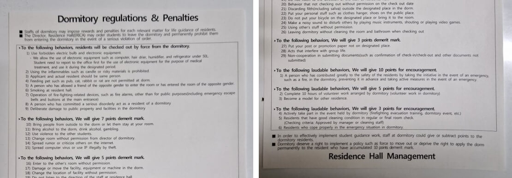
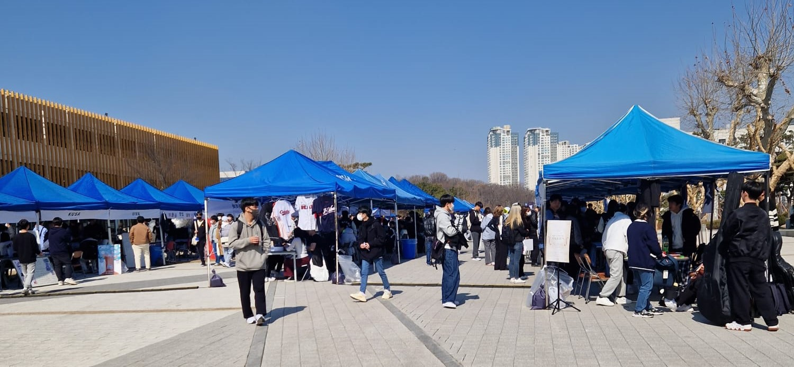
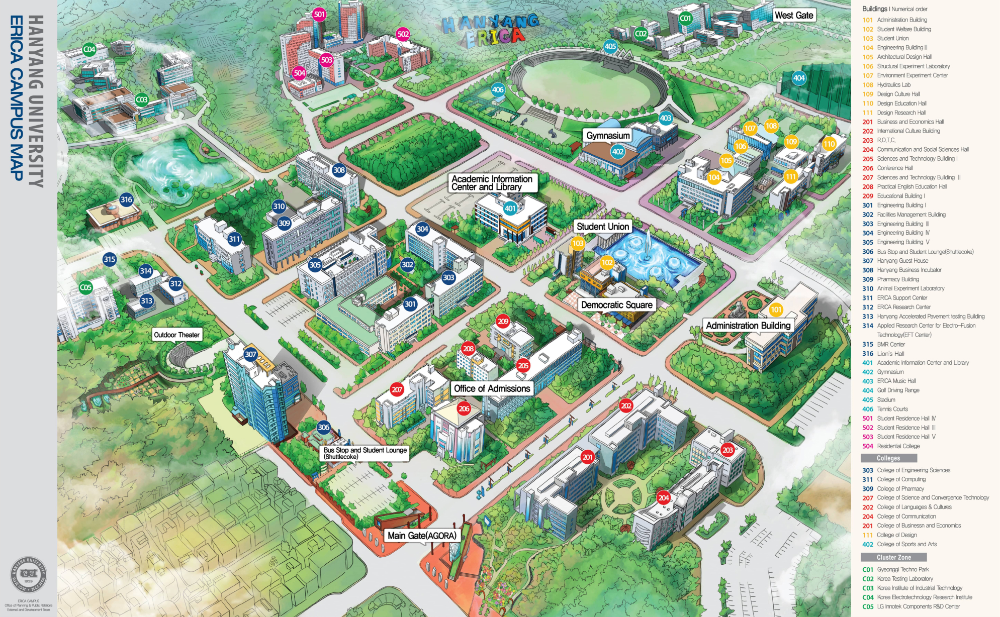

What is it like to go to South Korea and visit Hanyang University erica as a student from Germany? In the following I will talk about my experience in studying one semester at Hanyang University erica campus for summer 2023.

**Table of Contents**
<ol class="toc">
    <li>📝 <a href="#before-korea">Before Korea</a></li>
    <li>🇰🇷 <a href="#before-the-semester-but-in-korea">Before The Semester But In Korea</a></li>
    <li>🏛️ <a href="#start-of-the-new-semester">Start Of The New Semester</a></li>
    <ul>
        <li><a href="#the-dormitory-changei">The Dormitory (CHANGEI)</a></li>
        <li><a href="#student-clubs-events-and-programs">Student Clubs, Events And Programs</a></li>
        <li><a href="#courses-at-hanyang-erica">Courses At Hanyang erica</a></li>
        <li><a href="#the-campus">The Campus</a></li>
        <li><a href="#food">Food</a></li>
    </ul>
    <li>💸 <a href="#costs">Costs</a></li>
    <li>🤔 <a href="#hanyang--hanyang-erica---seoul-or-ansan">Hanyang & Hanyang erica - Seoul or Ansan?</a></li>
    <li>👍 <a href="#conclusion">Conclusion</a></li>
</ol>

As part of my studies on Code & Context at TH Köln I was able to do an additional optional semester in which I chose to go abroad. I will take about my time in Korea from February 2nd 2023 to x which was the last day for me on the erica campus.

As Code & Context is quite new there haven't been many students abroad during their studies, this meant a lot was unknown but also that the rules weren't that strict. I applied through my universities program to partner universities
I had applied in June for the following summer/spring semester but had to wait 5 months to know if I have been accepted or not.
The process itself also wasn't really straightforward but in the end everything had worked out. I had been accepted to Hanyang University erica campus for the spring semester of 2023.

## Before Korea

I didn't know much about Korea before going there, except the few things I had learned through my involvement in e-sports. My decision to go there has been somewhat random. I wanted to go somewhere completely different and I was determined that that should be South Korea.
For a lot of people I have met here in South Korea that was also the case, their decision to go there has been somewhat obituary. Just like me, they didn't have a particular interest in K-pop or K-dramas.

I also didn't prepare that much. I looked at a few guides and read experience reports, so I learned how to get my first T-Money card for public transport at the convenience store, what I need to buy a SIM card from Chingu Mobile, or to not tip at restaurants.

Two months before my flight I started to learn Korean. I learned Hangul and some basic expressions. I can recommend to anyone going to Korea for a longer period of time to at least learn Hangul, it can even be done quite quick, and it can help a lot with finding places and understanding the language.

Also had to do lots of paperwork for the university and to get the visa.

## Before The Semester But In Korea

I arrived in Korea on February 2nd, one month before my semester would begin. I arrived a bit early and in hindsight this was an amazing decision.

For February I stayed at the CoCo Livingtel in Anam, a goshitel where many exchange students who are going to Korea University stay. I didn't have many worries, only one and that was whether I could make friends. But these worries quickly vanished, as soon as I got to CoCo Livingtel I met lovely people with who I could explore Seoul together with. There weren't many people at the residence when I had arrived, as it was still one month away until university would start. But with each day new people got there, which was quite fun.

What is a goshitel? A ghoshitel is a place with many ghoshiwons. A ghoshiwon (고시원) is a tiny room. I had my smallish sized bed in there and enough space to take two steps with also my own bathroom which also was on the smaller side. The layout was also more Korean style, shower and toilet share their space/floor and you'd always have to hold the shower head yourself. My room also didn't have any windows.

But the CoCo Livingtel was amazing. It's a nice place to stay and I had a truly amazing time.

It was my first month in Korea and I loved it. So many amazing things to see, meeting so many amazing people. I can't put into words how great it was.

Then it was time for me to leave to go to Ansan where the Hanyang erica campus was. Ansan is to the south below Seoul, it's a city in Gyeonggi.

I visited the campus once in February to check in at the dormitory. But the campus was a bit ugly during that time and Ansan wasn't really inviting. At the time I thought that the campus would really be great for someone using their car, the campus is huge with lots of parking spaces. So my first impression wasn't actually the most positive.

I had gotten a bit socially exhausted from meeting multiple new people each day. But now it was time to go somewhere completely different again, a new environment where I did not know anyone.

## Start of the New Semester

So at the end of February I moved to my new home, the dormitory CHANGEI on the Hanyang erica campus. I still remember the great feeling of getting woken up by sunlight after one month in the goblin cave.

The start of the semester had some nice events like the welcoming day for all the exchange students for that semester. Met a lot of people that day and that was also the kick-off for the semester for me. From that day on I would be outside most of the day, meeting new people and enjoying the time with my new friends by eating together, studying, sports, travelling, course work, events, dates and more.
It was such a great environment. A new place with so many people who are in the same situation as you from all over the world. They also want to make new friends, use their limited time in Korea well and make great experiences. For me it was a great opportunity to grow out of my comfort zone, challenge old habits of mine and get a new perspective on things.

### The Dormitory (CHANGEI)

I had a shared room in the dormitory on the 3rd floor, I think there were up to 17 floors. Almost all rooms in the dormitory are for two people, so all exchange students living in the dormitory had a roommate. You choose the room before the semester starts and if you knew someone else beforehand you could choose the same room, but I, like most other students there, did not know anyone beforehand so I just picked a room and hoped for the best. I got lucky and had a really nice roommate from France.

It is always foreign students who get put together into a room, so you won't share a room with a Korean student. Other friends of a mine also had roommates from all over the world, Netherlands, Spain, Mexico, Japan, Denmark, UK, China and more. Although sometimes roommates were not able to speak the same language, like Chinese students who only knew Korean and Chinese together with German students who only knew English and German, this made for some fun stories.

The dormitory is also strictly gender separated and has some other weird rules, at least from a German/Western perspective.

There are many facilities inside the dormitory building. There's:
- Cafeteria (One side was the university food side & other side had two small restaurant chains and a cafe)
- Convenience Store (CU)
- Karaoke Rooms
- Areas for table tennis and badminton

The cafeteria was only okay but I liked it. The options were always a bit limited but enough. Taste was good enough and it was cheap, but nutrition and food variety was a bit lacking. Some friends of mine also just preferred to never eat there (there were other cafeterias on campus and nice restaurants right outside the main gate).
The cafeteria also had very strict opening hours (Breakfast: 07:50~09:00; Lunch: 11:30~13:20; Dinner: 17:10~18:40). Sometimes they would even run out of food before the stated time. So I'd miss the meal and there wasn't even a kitchen where you could have made your own stuff.

It cost me 1.223.600 KRW to stay at the dormitory for 4 months. There also was the option to stay for 6 months which would have cost 1.835.600 KRW.

### Student Clubs, Events And Programs

At Hanyang erica there are many different student clubs, events and programs like at most universities in Korea. There are many different activities available to students and there's much more of a campus life, the feeling of being in a community is much stronger compared to typical German universities.

Student clubs are organized by students. Early in the semester there's a small event where each club puts up a small booth. There you can talk to them and join the club. There was also an online list of all the clubs with short descriptions. Joining a club costs a small fee, most often somewhere between 10k - 15k won.

Hanyang erica had a mentor program called Hanmille buddy program. It pairs up each exchange student with a Korean student.
What kind of buddy you get can be very hit or miss. I had a very pleasant experience and it's also just a great chance for more interaction with Korean students which can be quite rare for many exchange students..

Then there are different events. Like mentioned before, there was one event where clubs would present themselves. But the highlight of the semester was definitely the university festival, which lasted for 3 days. During that time there was:
- a food street full of food trucks which were offering all kinds of street food. 
- photo booth tents to take picture together with friends.
- booths where you could play games and win small prizes.
- performances by student clubs and popular K-pop artists.
- after party drinks & food.
### Courses At Hanyang erica
Hanyang erica had a lot of different courses offered in English and I was very happy with the options they had.

I took the following courses:
- Visual Communication - Seeing is believing. 
- Survival Korean - A introduction to Korean, starts at the very basics. 
- Game Development - Class should have been called Game Design as we did not do any game development, only game design. Class had both Korean and international students which was very nice. The professor kept saying the same things in English once and then in Korean again though.
- Sports Physiology - Similar to my high school biology class but in English with a focus on sport related topics.
- UX Design - This class stood out positively. It was a collaboration with the government of Ansan. We'd do some lectures and assignments on designing interactions between people and an object and also designing a product / solution to a problem. At the end of the course we proposed a solution to a problem the city of Ansan was having. But quite a few parts of the class could only be done in Korean and we did not have much freedom in how we worked.

Passing most of my courses was quite easy and I did not have to spend a lot of time outside of class to work on them. But there are courses that are harder and require you to spend a lot of time on the class even outside of it.

I didn't enjoy the way the classes were thaught I don't think they are efficient to learn something. It reminded me a lot of my high schools classes as we were only doing theory without any relevant learning and practice and had no feedback culture.
The communication in class is very one-sided, the professor talks and decides without giving freedom to the students or regard to their opinion.
It felt impossible to acquire skills from the class, I'd forget everything after it was over. The exams were also done in an old-fashioned way, relying a lot on memorization and sometimes asking for the most random and useless information.
The classes I had in Code & Context were better in every way but that is an unfair comparison as they would also stand out from classes everywhere else. For me, learning something by myself or at Code & Context would have been multitudes more efficient than with a class I had there.
The classes were good to make friends though.

### The Campus

My first impression of it wasn't the best but I did grow to like it more. Especially once the semester began the huge campus was more filled with life and people.
On campus are:
- multiple cafeterias
- cafes
- restaurants
- student building (for student clubs)
- gym
- convenience stores
- big fountain and many seating options outside
- library to study

There are also many cherry blossom trees which look beautiful during the cherry blossom season.

### Food
Food in Korea is great. It's also a lot cheaper to go out and eat outside. So often I would go for lunch and dinner together with friends at the cafeteria or a nearby restaurant, atleast once per day.

Right outside the main gate of the university are a lot of restaurants. It does take close to 20 minutes to get there from the dormitory by foot though, but you can also take the shuttle bus if you want to time it.

A few of my favorites ==are: x==.

It is hard to find food in the university area at night though which often would not be the case in many areas in Seoul.

## Costs
The amount I was spending each month was similar to how much I spend per month in Germany. On average things in Korea are cheaper but as I spend every day outside I had more situations in which I would spend.

## Hanyang & Hanyang erica - Seoul or Ansan?
Hanyang University has two campi. One in Seoul and one in Ansan. Many exchange students are suprised when they apply to Hanyang and get sent to the erica campus, which is in Ansan. The two locations are like two different universities, so once you are sent to the erica campus you will have nothing to do with the campus in Seoul. And most exchange students will get send to erica campus.

Ansan is directly to the south of Seoul. Getting to some place in Seoul takes around 90 minutes (Of course this heavily depends on where in Seoul).

If you want to look up how long it takes to go from place A to B use Naver Maps or Kakao Maps. Google Maps does not work in Korea.

I can recommend to anyone going to Hanyang erica to life in the on-campus dormitory. It was great to life together with so many friends and head out from the dormitory together.

## Conclusion
Overall my experience in South Korea was great. The location of the Hanyang erica campus is not optimal to explore Korea though. The classes were academically not the most useful, but I did enjoy them sometimes. Overall I enjoyed my stay at the university a lot.

I also learned that I prefer to have my own room to sleep in. And that is what I had at my next exchange semester I did in South Korea. I went to University of Seoul right after my semester at Hanyang erica.

If you liked this post you might also enjoy my post about the exchange semester at University of Seoul I did for winter 2023 here (not published yet). Or my post focussing more on the different between Korea and the western world here (not published yet).

You can [join my mailing list](../follow) if you would like to get notified about new posts, I appreciate every single new member.

