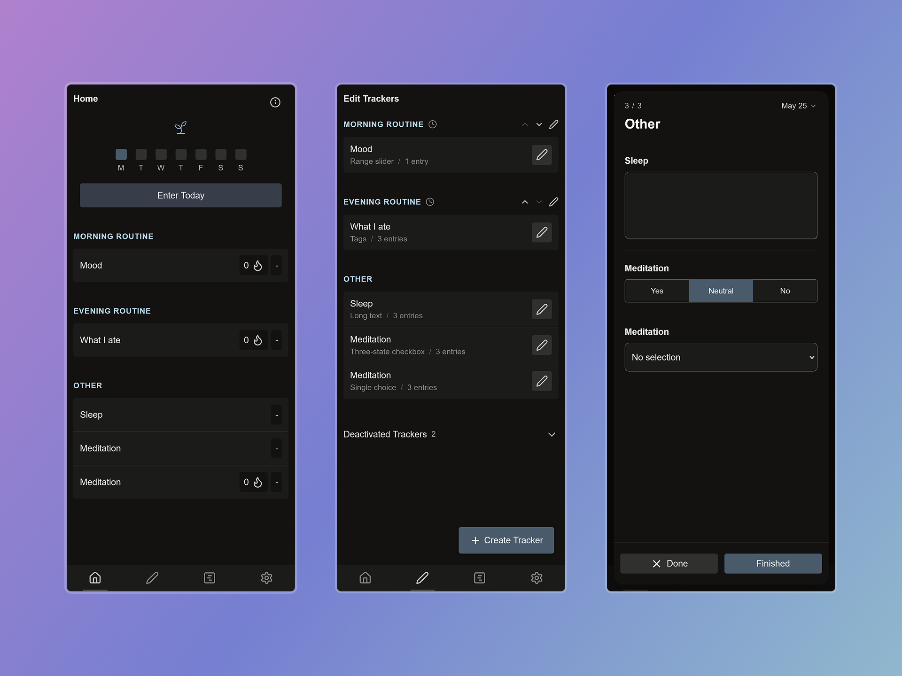
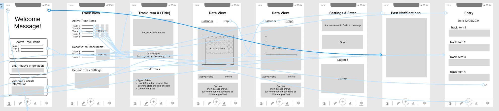

## DailySelfTrack

DailySelfTrack is a customizable self-tracking app combining elements from habit trackers, health logging and journaling.

This was a self-initiated project started as my final B.Sc. project and bachelor thesis, then further iterated and developed later on.

I led the full product process, research, UX design, visual design, development, testing, and product direction.

**View live app**: [app.dailyselftrack.com](https://app.dailyselftrack.com/)

### Problem

Most self-tracking apps are too rigid. Habit trackers, mood trackers and health logs lock you into predefined metrics and workflows. The fully flexible alternatives go the other way, spreadsheets, Notion or Obsidian let you track anything, but daily entry is slow and the UX is built for notes, not for tracking.

As part of working on this project I wrote my bachelor thesis answering the question: "Does greater customization in a self-tracking app improve usability and market fit?" and went in-depth analyzing the flexibility-usability trade-off.

### Design Direction & Process

The process looked like the following:

1. **Market & competitor analysis**: Looked at general market trends and analyzed 29 apps in the self-tracking space. Looked at which user needs are met, which aren't, and where a niche could exist.
2. **User survey**: Quantitative research on how people currently self-track and what they value about it. Used the results to check the gaps the market analysis suggested.
3. **Problem definition**: Most apps lock users into predefined metrics. The flexible alternatives are built for notes, not daily tracking. There is room in between.
4. **Personas**: Two user personas to guide design decisions.
5. **Sketches, flowchart and clickable Figma wireframe**: Went iteratively from sketches to flowchart to clickable Figma wireframe. User tested the Figma wireframe.

6. **MVP**: Built first MVP version using SvelteKit + Capacitor with custom CSS. Trackers are user-defined (text, number, checkbox), advanced options hidden behind progressive disclosure, defaults are sensible, and storage is local only.
7. **Usability + market-fit testing**: Task-based observation, the SUS questionnaire, and follow-up questions for market-fit evaluations.

Testing showed greater customization can work, as long as the added complexity stays hidden until the user wants it. The main tools for this are progressive disclosure, sensible defaults and contextual help. There is a user need behind solutions in self-tracking that can be highly customized to unique needs and continue to adapt to changing user needs. 

### Implementation

The tech-stack went through three iterations.

1. **React Native + Expo**
2. **Ionic React + Capacitor**
3. **SvelteKit + Capacitor + Dexie.js** (current): Low styling overhead, fast dev loop, and built-in routing. Uses IndexedDB through Dexie. One codebase that ships to web/PWA, Android, iOS, and Windows/macOS/Linux through Tauri.

The app is local-first. All user data stays on the device by default.

### Outcome

The app is currently usable on the web and as a PWA (not launched yet) on [app.dailyselftrack.com](https://app.dailyselftrack.com/) and the Android version is ready for user-testing.

<video width="100%" height="400" aria-label="DailySelfTrack app demo" controls muted>
  <source src="/videos/DailySelfTrack-App-Demo-Video-Portfolio-Bryan-Hogan.mp4" type="video/mp4">
  Your browser does not support the video tag.
</video>

The full bachelor thesis with the user-testing results is available on request.

---

## Freelance Project: Sorbit

Sorbit is a relationship-care app focused on social health, helping users actively maintain their closest relationships through a visual orbit-based relationship view, contact rhythms and reflective journaling.

This is a freelance collaboration with the project's founder, a social psychologist with a PhD. I am responsible for the technical implementation and part of the UX.

**Project site**: [sorbit.app](https://sorbit.app/) (German)

### Problem

Many people feel socially isolated despite being constantly digitally connected. Many relationships turn cold despite our wishes for forming deeper and more trusting relationships. Current trends show these issues are rising, social media platforms promote shallow interactions or have become outright anti-social, AI is replacing human interactions, third spaces are vanishing and a large part of our society is growing lonelier and more disconnected than ever before.

### Design Direction & Process

1. **Strategy & planning sessions** with the founder, aligning on technical and organizational requirements and defining project goals.
2. **Core features and timeline**: Defined the core feature set with the founder and built a timeline from there. Specific feature priorities stayed open, refined through design iterations.
3. **Personas and user journeys** to map the target users and how they manage their relationships. Wireframes built from those, covering the core flows.
4. **Wireframe user testing with AI-generated MVP**, to verify the features and flows land and to adjust the feature plans and prioritization. Used Nielsen Norman Group methods for modern usability testing such as task-based observation, think-aloud protocol and follow-up interviews.
5. **Design mockups** for the central views (home and orbit view), informed by wireframe feedback and what we learned from the AI MVP.
6. **Phase 1 development**: core architecture.
7. **Phase 2 development**: central features.
8. **User testing**

### Implementation

The stack is SvelteKit with Capacitor and Dexie.js, mirroring what worked well on DailySelfTrack: a web-first PWA from a single codebase that can be bundled to native iOS and Android. Data is local-first via IndexedDB, which fits the privacy expectations of a relationship-care app.

Core features delivered in the MVP:

- Contact creation with adjustable information
- Complex SVG based visualizations
- Journal entries tied to contacts with metrics which are analyzed
- Reminder logic
- Further details omitted as app is still in-house only.

Built to be extensible and maintainable by other developers long-term.

### Outcome

The app is currently being tested in-house and not released yet.

---

## Include

- Freelance Project A
- GameToLearnKorean

## Other

- Lenevin designs
- General social media designs